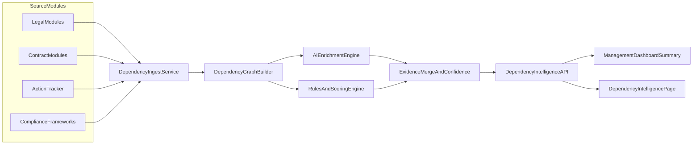

# Dependency Intelligence Sprint 1

## Sprint Objective (Business Value)

This sprint delivers an executive-grade leadership view that exposes interlinkages across **Legal modules**, **Contract modules**, **Action Tracker**, and **Compliance obligations** so that:

- Leadership can quickly identify what is blocking operations and why.
- Financial exposure can be quantified with explainable evidence.
- Shared-team bottlenecks and ownership overlap become visible.
- Pending actions are surfaced with due-date criticality and compliance escalation priority.
- Users can move from insight to action without context switching.

## System Design Summary (from current solution architecture plan)

Core approach: a deterministic relationship graph as system-of-record, with optional AI enrichment only for weak/missing links.

Key concepts

- Nodes: Legal artifacts, contract artifacts, actions, owners/teams, compliance obligations, and impacted business operations.
- Edges: `depends_on`, `blocks`, `owned_by`, `impacts_framework`, `drives_financial_impact`.
- Scoring: operational blockage + overdue/action urgency + compliance criticality + financial exposure.
- Explainability: every score has traceable evidence (source records + rule evaluations + AI confidence when used).

Mermaid overview

## Sprint Delivery Artifacts (in `srinathkm/GRC-Product`)

1. **Milestone**: `Dependency Intelligence Sprint 1` (title exact)
2. **GitHub Issues**: One Issue per feature request below, each containing the same standardized sections:

- Scope
- End-user story
- Technical design
- API/UI changes
- Security & auditability
- Data contracts
- Extensive testing plan (unit/integration/contract/E2E/security/resilience)
- Acceptance criteria
- Observability requirements

1. **Markdown sprint doc**: `sprints/Dependency-Intelligence-Sprint-1.md`

## Feature Requests (Issues)

### FR-1: ADRs for Graph Model + Explainability + Hybrid AI Policy (`adr-contract`)

**Summary**
Finalize ADRs that lock: graph model semantics, explainability guarantees, and hybrid AI guardrails.

**End-user perspective**
Leadership receives scores they can trust because every critical metric is explainable and auditable.

**Technical scope**

- ADR-001 Data model: deterministic relationship graph as system-of-record.
- ADR-002 Explainability: scoring trace, evidence store, AI confidence boundaries.
- ADR-003 UX delivery: summary-first on Management Dashboard, deep-dive for investigation.
- ADR-004 Risk posture: AI never auto-finalizes critical statuses without deterministic guardrails.

**Non-goals**

- No performance optimization beyond baseline graph recompute.
- No new dependency persistence layer in this issue (unless required by auditability).

**Acceptance criteria**

- ADR set exists with clear invariants and failure modes.
- Evidence and scoring trace schemas are defined.
- AI enrichment policy includes confidence thresholds and “cannot override deterministic links” rule.

**Testing plan (ADR validation)**

- Design review checklist validation: each ADR item checked against the system architecture review gate.
- “Evidence trace” checklist: confirm that every score output includes a trace object schema.

---

### FR-2: Dependency Graph Builder + Scoring Engine + API Contracts (`backend-graph`)

**Summary**
Implement deterministic graph ingestion, edge resolution, scoring model, and API endpoints.

**End-user perspective**
Leadership can open the executive summary and click into dependency clusters that show: blocked operations, owners/teams, and impact severity.

**Technical scope**

- Services
  - `dependencyGraphService.js`: canonicalization for legal/contract/action/compliance entities.
  - `dependencyScoringService.js`: severity scoring + financial impact buckets.
- API endpoints
  - `GET /api/dependency-intelligence/summary`
  - `GET /api/dependency-intelligence/clusters`
  - `GET /api/dependency-intelligence/:id`
- Extend Management Dashboard summary payload with dependency intelligence overview.

**Data contracts**

- Define response schema for each endpoint.
- Define error taxonomy: `VALIDATION_ERROR`, `DATA_MISSING`, `UPSTREAM_TIMEOUT`, `INTERNAL_ERROR`.
- Define scoring trace object shape.

**Security & auditability**

- No PII leakage beyond what existing modules allow.
- All derived insights include a trace of source IDs.

**Acceptance criteria**

- Deterministic graph build yields stable output for identical input snapshots.
- Scoring trace exists for each cluster and is internally consistent.

**Extensive testing plan**

- Unit tests
  - Canonical ID resolution (edge cases: missing fields, mismatched casing, free-zone strings).
  - Edge resolution rules for `depends_on`, `blocks`, `owned_by`, `impacts_framework`.
  - Scoring calculations (boundary conditions for severity score bands).
- Integration tests
  - Endpoint tests for all new routes using Express test harness.
  - Payload compatibility test: Management Dashboard rendering contract.
- Contract tests
  - Validate response JSON schema for endpoints.
- Resilience tests
  - Partial dataset availability: ensure graceful degradation.
  - Retry/timeouts for any upstream reads.
- Security tests
  - Ensure RBAC/role gating (if enforced in UI) cannot be bypassed.
  - Injection safety: JSON fields sanitized/validated.

**E2E analysis**

- Scenario: a contract obligation references a POA expiry; action is overdue; compliance obligation maps to impacted control.
- Expected: summary severity increases, cluster appears, drill-down shows trace + overdue action + compliance escalation.

---

### FR-3: Management Dashboard Executive Summary Cards + Drill-down (`frontend-exec-summary`)

**Summary**
Add executive cards and a dependency cluster list to leadership view.

**End-user perspective**
Leadership can see top 5 clusters within 30 seconds, and each cluster provides “View Details” into a chain of evidence.

**Technical scope**

- Update [Management Dashboard component] to render:
  - Critical dependency clusters (with severity chips)
  - Shared-team bottleneck index
  - Compliance-linked pending actions count
  - Financial exposure bucket
- Add interaction:
  - Clicking cluster navigates to Dependency Intelligence page with the cluster ID.

**Acceptance criteria**

- Executive summary renders with empty-state behavior when no clusters exist.
- Loading and error states are user-friendly and do not break the dashboard.
- A11y: keyboard navigation and focus states for all interactive elements.

**Extensive testing plan**

- Component tests (where applicable)
  - Rendering under: success, empty, partial failure (some panels missing).
- Visual regression
  - Confirm tokens/contrast and no light text regression.
- Accessibility tests
  - Tab order, aria attributes for expansion/collapse.
- E2E UI flows (smoke)
  - Load Dashboard -> find critical clusters -> open detail.

---

### FR-4: Dependency Intelligence Page (Filters + Evidence Drill-down) (`frontend-detail-page`)

**Summary**
Create dedicated page for dependency map/list + evidence drill-down.

**End-user perspective**
Users can filter by parent/opco/team/framework/severity/action status and understand exactly how the dependency impacts business operations and compliance.

**Technical scope**

- Page interactions
  - Filters and saved filter state.
  - Detail view: dependency chain visualization, financial impact breakdown, impacted operations list.
  - Action list: pending actions with due dates + owners.
  - Compliance display: show impacted controls/obligations with escalation triggers.

**Acceptance criteria**

- Filter results match backend query semantics.
- Evidence drill-down shows trace and source references.
- No hallucinated financial impact: every number has a trace.

**Extensive testing plan**

- Frontend integration tests
  - API response mapping correctness for all panels.
- Contract/UI mapping tests
  - If backend adds a field, UI ignores unknown fields safely.
- E2E tests
  - With representative fixtures: corporate vs member owners, contracts with multiple obligations, multiple impacted operations.

---

### FR-5: Hybrid AI Controls (AI enrichment boundaries, confidence, evidence merge rules) (`hybrid-ai-controls`)

**Summary**
Define and implement AI enrichment so it only helps where deterministic confidence is low and never overwrites deterministic links.

**End-user perspective**
AI suggests likely links but leadership sees what is deterministic and what is AI-suggested.

**Technical scope**

- AI enrichment triggers
  - Missing `depends_on` edges
  - Low confidence mappings
  - Ambiguous obligation-to-operation mapping
- Confidence policy
  - Confidence thresholds per edge type.
  - AI-suggested edges are marked and require review if critical.

**Acceptance criteria**

- Deterministic edges immutable.
- AI edges stored with confidence + evidence snippets.
- Critical operations always require deterministic evidence.

**Extensive testing plan**

- Deterministic vs AI override tests
  - Ensure AI cannot replace deterministic edges.
- AI failure tests
  - When LLM unavailable: system returns deterministic-only output.
- Evidence merge tests
  - Trace contains both deterministic and AI evidence when applicable.
- Safety tests
  - Verify no PII leakage in AI prompts.

---

### FR-6: QA Audit + End-to-End Verification Plan (`qa-audit`)

**Summary**
Execute full verification strategy: unit/integration/contract/E2E/security/resilience; generate audit report.

**End-user perspective**
Confidence that leadership can trust the dependency insights and take action safely.

**Acceptance criteria**

- Test coverage meets the minimum bar defined in this sprint document.
- Audit report includes pass/fail with evidence for:
  - scoring explainability
  - financial impact trace
  - action tracker wiring
  - compliance linkage and escalation triggers

**Extensive testing plan**

- Test harness plan
  - Add minimal test tooling if not present (suggested: `node:test`, `supertest` for APIs; Playwright for E2E).
- Scenario matrix
  - Legal dependency -> contract obligation -> action overdue -> compliance control impacted.
  - Multi-opco and multi-team ownership overlap.
  - Missing documents.
  - LLM unavailable.
- Non-functional tests
  - Load: ensure summary endpoint responds within a target SLA.
  - Resilience: timeouts and partial failures.

---

## End-to-End Analysis & Scenario Coverage (Across Sprint)

Provide at least the following scenarios as acceptance-level E2E fixtures:

1. Critical POA expiry blocks contract authority usage; owner is legal team; action overdue; compliance control is critical.
2. Contract renewal window approaching; deterministic link exists; AI enrichment adds only missing operation mapping.
3. Litigation creates contractual/IP obligations; dependency chain shows financial exposure; actions are created in tracker.
4. Document completeness gaps trigger compliance escalation; severity increases; UI highlights escalation triggers.
5. LLM unavailable: system returns deterministic-only and explicitly marks AI enrichment as unavailable.

## Observability Requirements (Cross-cutting)

- Correlation IDs in every API request.
- Structured logs for:
  - graph build
  - scoring
  - AI enrichment
  - evidence merge
- Metrics
  - dependency graph compute latency
  - number of clusters returned
  - percentage deterministically resolved vs AI-suggested
  - endpoint error rates

## Implementation Order (Sprint Timeline Suggestion)

- Day 1-2: FR-1 ADR finalized.
- Day 2-5: FR-2 graph + scoring + APIs.
- Day 4-7: FR-3 UI executive summary.
- Day 6-10: FR-4 dependency detail page.
- Day 8-11: FR-5 hybrid AI controls.
- Day 10-14: FR-6 QA audit and full test execution.

## Sprint Success Criteria

- Leadership can interpret and act on insights.
- All key metrics provide evidence trace.
- No silent failures; empty states are safe.
- Deterministic integrity preserved.
- Security posture: no PII leakage, validated inputs, RBAC/authorization preserved.

## Created in this sprint (artifact links)

- Milestone: https://github.com/srinathkm/GRC-Product/milestone/1

## Feature Requests

- FR-1: https://github.com/srinathkm/GRC-Product/issues/12
- FR-2: https://github.com/srinathkm/GRC-Product/issues/13
- FR-3: https://github.com/srinathkm/GRC-Product/issues/14
- FR-4: https://github.com/srinathkm/GRC-Product/issues/15
- FR-5: https://github.com/srinathkm/GRC-Product/issues/16
- FR-6: https://github.com/srinathkm/GRC-Product/issues/17

