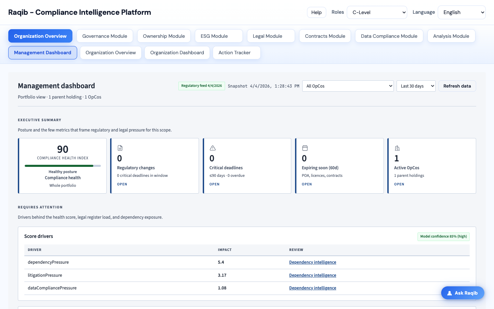

<div align="center">

# Raqib - Compliance Intelligence Platform

**Governance, risk, and compliance for GCC and Middle East regulatory frameworks**

*Unified regulatory intelligence, entity and ownership management, data compliance, and AI-assisted analysis in a single web application.*

<br/>



<br/>

[Quick start](#-quick-start) · [Stack](#-technology-stack) · [Capabilities](#-capabilities-at-a-glance) · [Deploy](#-deployment) · [Documentation](#-documentation)

</div>

---

## Overview

**Raqib** helps legal, governance, data security, and executive teams monitor **regulatory change**, **organizational exposure**, **legal registers**, **UBO and ownership structure**, and **data / security posture**—with optional **LLM** support for chat, document extraction, and summaries.

| | |
|---|---|
| **Front end** | React (Vite), role-aware navigation, responsive dashboards |
| **API** | Node.js (Express), REST under `/api/*` |
| **Data** | JSON registers in `server/data/` (configurable); browser storage for selected UBO flows |
| **Optional** | OpenAI-compatible LLM, SMTP email, Azure Defender evidence imports, SharePoint (where configured) |

---

## Capabilities at a glance

| Area | What you get |
|------|----------------|
| **Executive & org** | Management dashboard, organization overview, org dashboard, task tracker |
| **Governance** | Onboarding, parent holding overview, governance framework (20+ frameworks), dependency intelligence |
| **Ownership** | Multi-jurisdiction matrix, UBO register, holding structure, **ownership graph** from documents |
| **ESG** | ESG summary, scoring, and comparison by parent |
| **Legal registers** | POA, IP, licences, litigations; contracts lifecycle and document upload |
| **Data** | Data sovereignty checks, data security compliance (incl. Defender integration) |
| **Analysis** | AI risk prediction, heat maps, deadlines; M&A simulator |
| **Compliance ops** | Data compliance governance workflows, compliance deltas, audit trail support |

For a **full feature narrative**, see **[docs/PRODUCT_FEATURES_AND_FUNCTIONALITY.md](docs/PRODUCT_FEATURES_AND_FUNCTIONALITY.md)**.

---

## Quick start

**Prerequisites:** Node.js 18+ recommended.

1. **Install dependencies** (not committed to git—run after every clone):

   ```bash
   npm run install:all
   ```

2. **Run the app** (API + Vite client):

   ```bash
   npm run dev
   ```

   | Service | URL |
   |---------|-----|
   | Frontend | [http://localhost:5173](http://localhost:5173) |
   | API | [http://localhost:3001](http://localhost:3001) |

3. **Optional environment** — copy `server/.env.example` to `server/.env` and set:

   | Variable | Purpose |
   |----------|---------|
   | `OPENAI_API_KEY` | AI chat, change assistance, UBO / document extraction |
   | `LLM_BASE_URL` / `LLM_MODEL` | Override LLM endpoint and model (incl. Defender summaries) |
   | SMTP variables | Email delivery for regulation changes |

---

## Technology stack

| Layer | Choice |
|-------|--------|
| UI | React 18, Vite |
| API | Express 4 |
| Auth / session | Cookie-based (`/api/auth`) as implemented |
| Data | File-backed JSON under `server/data/`; uploads under `server/data/contract-uploads/` (gitignored at runtime) |
| AI | Server-side OpenAI-compatible client when keys are set |
| E2E | Playwright (`npm run test:e2e`) |

---

## Deployment

Single-container and static-IP style deployment is supported via Docker and helper scripts.

1. Copy or package the repo (`npm run docker:package` produces a tarball excluding `node_modules`).
2. Run `./deploy.sh` on the host (creates `.env` if needed, builds, starts).
3. Serve on **port 3001** (API + built SPA).

**Details:** **[DEPLOY.md](DEPLOY.md)**

---

## Repository layout

```
regulation-changes-dashboard/
├── client/                 # Vite + React SPA
├── server/                 # Express API, services, routes, tests
│   └── data/               # JSON registers and runtime stores (see .gitignore)
├── docs/                   # Product docs, architecture collateral, images
├── collaterals/            # PDF-ready end-to-end product documentation (Markdown + figures)
├── collateral/             # Client-facing architecture diagrams (export to slides)
├── demo-files/             # Optional demo PDFs and sourcing notes
├── e2e/                    # Playwright specs
└── README.md               # This file
```

---

## Data & storage (summary)

| Store | Role |
|-------|------|
| `server/data/changes.json` | Regulatory changes and deadlines |
| `server/data/companies.json` | Parent / OpCo mappings by framework (when populated) |
| `server/data/*.json` | POA, contracts, licences, litigations, tasks, ESG, etc. |
| Browser `localStorage` | UBO register and related logs (as implemented) |
| Defender JSON files | Upload metadata, snapshots, findings, scores, summaries (see `.gitignore` for generated files) |

Defender integration details and UI behaviour are documented in **[docs/PRODUCT_FEATURES_AND_FUNCTIONALITY.md](docs/PRODUCT_FEATURES_AND_FUNCTIONALITY.md)** (search for *Defender*).

---

## Documentation

| Document | Content |
|----------|---------|
| [docs/PRODUCT_FEATURES_AND_FUNCTIONALITY.md](docs/PRODUCT_FEATURES_AND_FUNCTIONALITY.md) | Deep product and feature description |
| [collaterals/RAQIB_END_TO_END_DOCUMENTATION.md](collaterals/RAQIB_END_TO_END_DOCUMENTATION.md) | End-to-end collateral: objectives, scenarios, value, modules, LLM map (PDF-friendly) |
| [docs/PRODUCTION_READINESS_REPORT.md](docs/PRODUCTION_READINESS_REPORT.md) | Production readiness notes |
| [collateral/architecture/presentation-architecture.md](collateral/architecture/presentation-architecture.md) | Architecture diagrams for stakeholders (Mermaid) |
| [DEPLOY.md](DEPLOY.md) | Docker and deployment |

---

## Scripts

| Command | Description |
|---------|-------------|
| `npm run install:all` | Install root, `client`, and `server` dependencies |
| `npm run dev` | Concurrent API + Vite dev server |
| `npm run build` | Production build of the client |
| `npm run start` | Start API (production; serve built client from `server/public` when present) |
| `npm test` | Server unit tests |
| `npm run test:e2e` | Playwright E2E tests |
| `npm run capture:readme-screenshot` | Regenerate `docs/images/readme-product-hero.png` (requires `npm run dev` / Vite on port 5173) |

---

## Contributing & support

Use issues and pull requests on the hosting repository. Keep **secrets and customer data** out of the repo; rely on `.env` and gitignored paths for local and runtime data.

---

<p align="center">
  <sub>Screenshot captured from the dev app at <code>http://localhost:5173</code> (default view). Re-run <code>npm run capture:readme-screenshot</code> with the client running to refresh this image.</sub>
</p>
