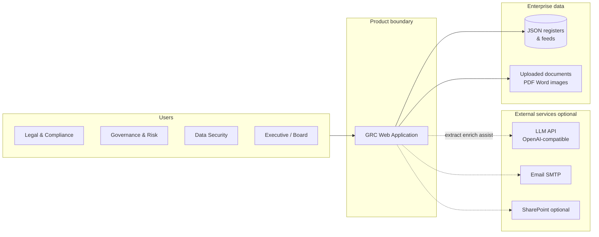
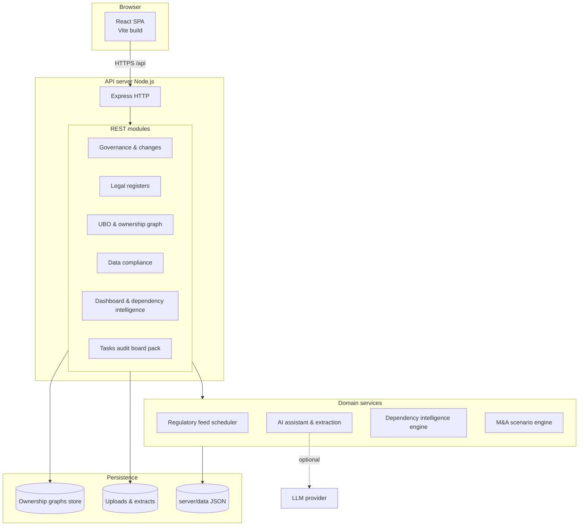
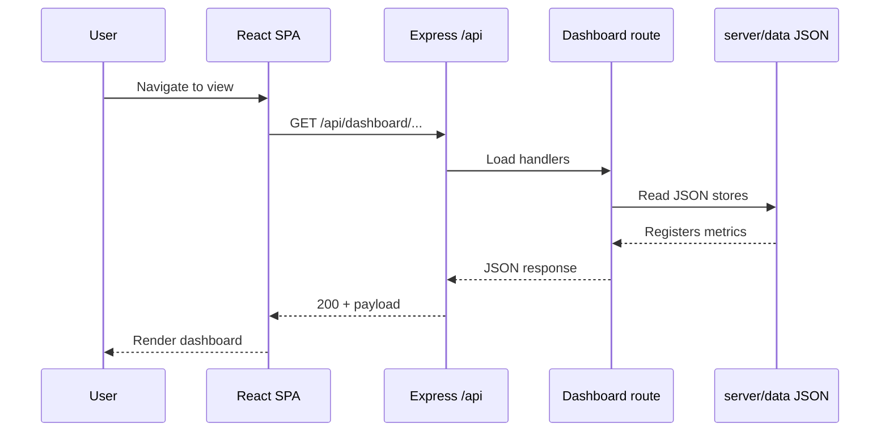
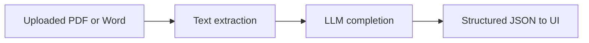

# Regulation Changes Dashboard — End-to-End Architecture (Client & Prospect Deck)

**Purpose:** Single reference for **presentation slides** — system context, major components, data flows, and external dependencies.  
**Audience:** Clients, prospects, security reviewers (high level, not implementation detail).

---

## 1. One-page system context

Who touches the system and what sits outside the product boundary.

---

## 2. Application architecture (containers)

**Runtime:** Browser SPA talks to a **Node.js REST API**. Development uses Vite proxy; production can serve the built SPA from the same origin.

---

## 3. Domain map (what the product covers)

Groupings align with navigation and API routes — useful for **capability slides**.

```mermaid
flowchart LR
  subgraph g [Governance & regulatory]
    GF[Governance framework]
    RC[Regulatory changes feed]
    MJ[Multi-jurisdiction]
  end

  subgraph l [Legal & entity]
    POA[POA IP Licences]
    LIT[Litigations contracts]
    UBO[UBO register]
    OG2[Ownership graph]
  end

  subgraph d [Data & security]
    DS[Data sovereignty]
    DC[Data compliance governance]
    DF[Defender integration]
  end

  subgraph i [Intelligence & ops]
    MD[Management dashboard]
    DI[Dependency intelligence]
    AN[Analysis & M&A]
    TK[Tasks & audit]
  end

  g --- l
  l --- d
  d --- i
```

---

## 4. Request path (typical user action)

**Example:** Open Management Dashboard → aggregated KPIs from stored JSON and computed metrics.

---

## 5. AI-assisted flows (optional)

When `LLM_API_KEY` is configured, document extraction, ownership graph parsing, and the global assistant use the same LLM abstraction.

If the key is absent, those features **degrade gracefully** (empty graph, message to enable LLM, etc.) — important for **on-prem or air-gapped** discussions.

---

## 6. Deployment shapes (talk track)

| Shape | Description |
|--------|-------------|
| **Local dev** | `client` Vite :5173 → proxy → `server` :3001 |
| **Single host** | Build client to `client/dist`, copy to `server/public`, one Node process |
| **Container** | Optional Docker: same image serves API + static UI |

---

## 7. Using this in slides

1. **Slide 1 — Context:** Section 1 diagram (who + boundary).  
2. **Slide 2 — Architecture:** Section 2 (containers).  
3. **Slide 3 — Capabilities:** Section 3 (domain map).  
4. **Slide 4 — Data & AI:** Sections 4–5 (optional second slide for AI).  
5. **Slide 5 — Deployment:** Section 6 table.

**Export:** Copy Mermaid into [Mermaid Live Editor](https://mermaid.live), export **PNG/SVG** for PowerPoint/Keynote/Google Slides.  
**Vector:** Use [`architecture-e2e.svg`](architecture-e2e.svg) in this folder for a single sharp slide graphic.

---

## Disclaimer

Diagrams reflect the **current codebase shape** (Express + React + JSON stores + optional LLM). Integrations (SharePoint, email) and feed sources are **configurable**; adjust the talk track if your deployment differs.
