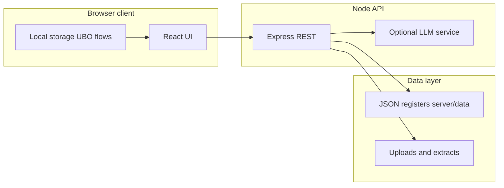

# Raqib — End-to-end product documentation

This document is written in **Markdown** so it can be converted to **PDF** (e.g. Pandoc, VS Code “Markdown PDF”, GitHub/GitLab export, or enterprise doc pipelines). **Mermaid** diagrams render on GitHub and many Markdown viewers; for some PDF tools you may need to export diagrams as images first.

**Related repository assets**

| Asset | Path |
|-------|------|
| Product deep-dive (features, APIs) | [`docs/PRODUCT_FEATURES_AND_FUNCTIONALITY.md`](../docs/PRODUCT_FEATURES_AND_FUNCTIONALITY.md) |
| Repository README | [`README.md`](../README.md) |
| Product hero screenshot | [`docs/images/readme-product-hero.png`](../docs/images/readme-product-hero.png) |

---

## Document control

| Field | Value |
|-------|--------|
| Document | Raqib end-to-end collateral |
| Version | 1.0 |
| Intended audience | Executives, GRC/legal/IT sponsors, customer success, presales |
| Scope | Application behaviour as implemented in this codebase; optional LLM features require configuration |

---

## 1. Core objective of the application

**Raqib** is a **governance, risk, and compliance (GRC) intelligence platform** aimed at organisations operating under **GCC and Middle East** regulatory frameworks. It provides a **single place** to:

- Track **regulatory and framework changes** and see **impact** down to **parent holdings** and **operating companies (OpCos)**.
- Maintain **organisational context** (parent / OpCo relationships, jurisdictions, frameworks).
- Run **ownership and UBO** processes, including **ownership graphs** derived from documents where configured.
- Manage **legal registers** (powers of attorney, IP, licences, litigations) and **contracts** lifecycle with document upload.
- Monitor **data sovereignty** and **data security** posture (including optional integration hooks such as Microsoft Defender where configured).
- Use **analysis** tools (risk prediction, M&amp;A-style scenarios) and **portfolio-style** connections across registers **without** replacing statutory legal advice.

**North star:** Reduce fragmentation across spreadsheets, email, and isolated tools by **structuring** the same underlying data for **dashboards**, **registers**, **workflows**, and **optional AI assistance**—with **human review** for high-impact actions.

---

## 2. Example scenarios (five use cases)

These **illustrative scenarios** describe how teams adopt Raqib in practice.

### Scenario A — Chief risk officer: “What changed this quarter for our UAE banks?”

A **C-level** user selects the **Governance framework** view, filters by **CBUAE / DFSA** (as applicable), sets the period to **six months**, and runs **Show changes**. The **impact tree** shows **framework → change → parent** with deadlines. They export a **PDF** for the board pack and optionally use the **AI chat** (with guardrails) to ask clarifying questions grounded in loaded change data.

### Scenario B — Group company secretary: “Which OpCos miss UBO evidence?”

A **governance** user opens **Ultimate beneficiary owner**, selects a **parent holding**, reviews the **register table**, filters **Pending / Not updated**, and uses **Mandatory documents** to track uploads. **Optional LLM** can **extract** fields from an **image** of an ID when `OPENAI_API_KEY` is configured.

### Scenario C — Legal counsel: “Summarise this contract and track renewal.”

A **legal** user uploads a contract under **Contract lifecycle** or **Upload document contract**, uses **metadata extraction** where the LLM is enabled, and records **POA / IP / litigations** in the respective registers. **Deadlines** and **risk** fields support operational follow-up.

### Scenario D — Data protection lead: “Where is data localisation at risk?”

A **data security** user opens **Data sovereignty**, selects a **parent**, and reviews **Critical / Medium / Low** checks per OpCo. They prioritise remediation and align with **Data security compliance** (including optional Defender-backed evidence where integrated).

### Scenario E — M&amp;A workstream: “What is the regulatory overlap if we acquire target X?”

A **board / strategy** user runs **M&amp;A simulator** under **Analysis**, compares scenarios, and cross-checks **Multi-jurisdiction matrix** and **Dependency intelligence** for regulatory dependencies. **Portfolio connections** can highlight **cross-holdings** from **stored ownership graphs** (deterministic rules; not generative legal advice).

---

## 3. Business value

| Theme | Value |
|-------|--------|
| **Single pane of glass** | One application for regulatory change, entity structure, legal registers, and data posture—fewer handoffs. |
| **Faster decisions** | Impact trees, dashboards, and deadlines make **prioritisation** visible without manual reconciliation. |
| **Auditability** | Structured registers and exports (PDF, email, CSV where implemented) support **evidence trails**. |
| **Regional fit** | Framework lists and jurisdiction constructs align with **GCC / Middle East** regulatory language. |
| **Optional intelligence** | LLM features augment **summaries, extraction, and chat** when keys are configured; core flows still operate without LLM. |
| **Role-aware navigation** | The UI exposes **role presets** (legal, governance, data security, board, c-level) to reduce clutter for each persona. |

---

## 4. Cost savings (illustrative)

The figures below are **order-of-magnitude illustrations** for business cases—not guarantees. Replace assumptions with your organisation’s **loaded cost rates** and **volumes**.

| Area | Mechanism | Illustrative range (notes) |
|------|-----------|-----------------------------|
| **Regulatory monitoring** | Less manual collation of changes; reusable PDF/email | **10–25%** FTE equivalent for teams spending significant time on manual horizon-scanning (assumption: 0.2–0.5 FTE affected) |
| **Deadline / incident avoidance** | Earlier visibility of overdue items and critical deadlines | **Risk avoidance** expressed as *expected loss reduction* (e.g. fewer late filings); model with your penalty / opportunity-cost assumptions |
| **Tool consolidation** | Fewer point solutions for registers and reporting | **5–15%** savings on redundant SaaS seats where Raqib replaces multiple low-usage tools |
| **Document handling** | Optional automated extraction for UBO/contracts | **15–30%** reduction in manual keying time for high-volume upload paths **when LLM is enabled** |

**Important:** Savings depend on **adoption**, **data quality**, and **process change**. The application enables efficiency; it does not replace **legal judgment** or **regulated filings**.

---

## 5. Operational efficiency

| Capability | Efficiency outcome |
|-------------|---------------------|
| **Management dashboard** | Executives see overdue deadlines and KPI-style summaries in one pass. |
| **Governance framework** | Filters + impact tree collapse weeks of email threads into a **structured** view. |
| **Task / action tracker** | Work is trackable alongside compliance context. |
| **Dependency intelligence** | Surfaces **dependencies** between changes, obligations, and entities for triage. |
| **Portfolio connections** | Rule-based **cross-holdings** and **litigation–register** links reduce manual graphing in spreadsheets. |
| **Registers & contracts** | Central JSON-backed APIs reduce duplicate entry versus siloed files. |
| **Analysis** | Risk prediction aggregates deadlines and history into **scores** and charts. |

---

## 6. Solution overview (data & components)

### 6.1 Technology summary

| Layer | Technology |
|-------|------------|
| **Front end** | React (Vite), CSS modules / component styles |
| **API** | Node.js, Express, REST under `/api/*` |
| **Persistence** | JSON files under `server/data/`; browser `localStorage` for parts of UBO flows |
| **Optional AI** | OpenAI-compatible API (`OPENAI_API_KEY`; optional `LLM_BASE_URL` / `LLM_MODEL`) |
| **Email** | SMTP via environment variables for regulation-change email |

### 6.2 Optional environment (high level)

| Variable | Role |
|----------|------|
| `OPENAI_API_KEY` | Enables LLM-backed chat, extraction, summaries where coded |
| `SMTP_*` | Outbound email for regulation-change reports |
| `PORT` / `BIND` | API listen address |

See [`README.md`](../README.md) and [`docs/PRODUCT_FEATURES_AND_FUNCTIONALITY.md`](../docs/PRODUCT_FEATURES_AND_FUNCTIONALITY.md) for detail.

---

## 7. Module landscape (illustration)

Screenshot reference (running app — Management Dashboard):

---

## 8. Per-module documentation (functionality order)

Sections follow the **main navigation module groups** in the product. For each module: **purpose**, **how onboarding / first use works**, **how work is done**, and **where the LLM applies** (if at all).

---

### 8.1 Organization overview module

**Sections:** Management dashboard · Organization overview · Organization dashboard · Portfolio connections · Action tracker

| Topic | Description |
|-------|-------------|
| **Purpose** | Executive and organisational visibility: KPIs, overdue regulatory items, entity summaries, tasks, and **portfolio** links across graphs and registers. |
| **Onboarding** | User selects **language** and **role** (header). Chooses **parent holding** and **OpCo** where views require scope. No separate “wizard” beyond **Governance onboarding** for document-driven setup (see §8.2). |
| **How it is done** | **Management dashboard** aggregates signals (e.g. overdue changes). **Org overview / dashboard** present parent and OpCo narratives. **Portfolio connections** queries **cross-holdings** from stored ownership graphs and **litigation impact** from legal JSON registers (**deterministic**; no LLM). **Action tracker** lists tasks. |
| **LLM** | **Not required** for portfolio connections. Other widgets may surface **links** to areas that use LLM (e.g. governance chat) but this module is primarily **structured data**. |

---

### 8.2 Governance module

**Sections:** Onboarding · Parent holding overview · Governance framework · Dependency intelligence

| Topic | Description |
|-------|-------------|
| **Purpose** | Load organisational and regulatory **context**: documents, parent/OpCo structure, **regulation changes** across many frameworks, and **dependency** analysis between changes and entities. |
| **Onboarding** | **Onboarding** view: upload **required documents** and business details to complete initial onboarding (per product UX). Users align **applicable frameworks** where the app stores them for governance views. |
| **How it is done** | **Parent holding overview** lists parents and OpCos with scores and jurisdictions. **Governance framework** loads **changes** (`GET /api/changes`), shows **impact tree**, snippets, **PDF** download, **email**, and **AI chat** (`POST /api/chat`) with **guardrails**. **Dependency intelligence** clusters regulatory dependencies; optional **AI** narrative when configured. |
| **LLM** | **Chat:** answers from recent changes context; **off-topic** messages blocked by guardrails. **Change lookup:** optional augmentation when `lookup=1` and key set. **Dependency intelligence:** optional AI-assisted text. **PDF/email** may include lookup when requested. |

---

### 8.3 Ownership module

**Sections:** Multi-jurisdiction matrix · Ultimate beneficiary owner

| Topic | Description |
|-------|-------------|
| **Purpose** | Visualise **where** OpCos operate and which **frameworks / zones** apply; maintain **UBO** registers and **ownership structure**; support **ownership graph extraction** from uploads. |
| **Onboarding** | Select **parent holding** then **OpCo**. UBO data is keyed by `parent::opco` in **browser localStorage** (see product doc). |
| **How it is done** | **Multi-jurisdiction matrix** maps OpCos to free zones and regulations. **UBO** tabs: register, holding structure graph, mandatory documents, UAE trade registry links. Document upload can call **`POST /api/ubo/extract`**. Ownership graph documents use extraction services (`ownershipGraphExtract`) and **persist** graphs server-side. |
| **LLM** | **UBO extract:** vision/text extraction from **images** (and paths for PDFs per implementation) when `OPENAI_API_KEY` is set. **Ownership graph extraction:** LLM parses structured **graph** from text. **Many UBO routes** include optional LLM branches—if the key is **missing**, the UI falls back to **manual** entry. |

---

### 8.4 ESG module

**Sections:** ESG summary

| Topic | Description |
|-------|-------------|
| **Purpose** | Present **ESG** capabilities, **MENA** framework references, **scoring** calculator, and **entity comparison** charts. |
| **Onboarding** | Typically select **parent holding** to scope entity comparison; calculator works with user-entered pillar scores/weights. |
| **How it is done** | Client-side scoring presets and charts; framework tables for **MENA** context. |
| **LLM** | **Not a core requirement** for ESG summary in the described implementation—scores are **user- or data-driven** in the client. |

---

### 8.5 Legal module

**Sections:** Legal document onboarding · POA management · IP management · Licence management · Litigations management

| Topic | Description |
|-------|-------------|
| **Purpose** | Centralise **legal registers**: POA, IP, licences, litigations with create/list/filter flows backed by **REST APIs** and JSON stores. |
| **Onboarding** | **Legal document onboarding** introduces legal documentation to the system; registers are populated per **parent / OpCo** with forms consistent across modules. |
| **How it is done** | Each sub-area loads and saves records via `/api/poa`, `/api/ip`, `/api/licences`, `/api/litigations` (see product documentation). Users filter by **parent**, edit rows, and attach **notes**. |
| **LLM** | **Contract-related** extraction routes (e.g. contracts) may call LLM when parsing uploaded text—**conditional** on configuration. Core CRUD **does not require** LLM. |

---

### 8.6 Contracts module

**Sections:** Contract lifecycle management · Upload document contract

| Topic | Description |
|-------|-------------|
| **Purpose** | Track **contracts** (metadata, risk, dates, parties) and **upload** contract documents for **review and extraction**. |
| **Onboarding** | Users configure **parent / OpCo** context and create or import contract records; uploads stored server-side per app patterns. |
| **How it is done** | List/create/update via contracts API; document upload pipeline processes text and may extract fields. |
| **LLM** | When configured, **text extraction / summarisation** from contract documents can use the LLM stack (`isLlmConfigured()` gates features in `contracts` routes). |

---

### 8.7 Data compliance module

**Sections:** Data sovereignty · Data security compliance

| Topic | Description |
|-------|-------------|
| **Purpose** | **Data sovereignty:** per-OpCo checks (localisation, cross-border, DPA, DPIAs, etc.) with severity. **Data security compliance:** control tracking and optional **Defender** evidence imports where integrated. |
| **Onboarding** | Select **parent holding** so OpCos load; review **cards** (Critical / Medium / Low / Met) and filters. |
| **How it is done** | Sovereignty uses structured mock/rule data in the client per product doc; data security views surface compliance items and integrations. |
| **LLM** | **Not the primary mechanism** for sovereignty scoring—**rules and structured checks** dominate. Defender or LLM-based **summaries** may appear in integration-specific paths when enabled. |

---

### 8.8 Analysis module

**Sections:** Risk predictor · M&amp;A simulator

| Topic | Description |
|-------|-------------|
| **Purpose** | **Risk prediction:** scores and charts from deadlines + optional **historical** upload. **M&amp;A simulator:** scenario comparison for assessments (see `server` M&amp;A routes and data). |
| **Onboarding** | Select **parent**; optionally upload **CSV/JSON** history for risk prediction. |
| **How it is done** | Server aggregates `changes.json` + `companies.json` (+ history) into **risk scores**, charts, deadlines. M&amp;A flows use scenario JSON and assessment engines. |
| **LLM** | **Risk prediction explanation:** optional **narrative** paragraphs via `createChatCompletion` when the key is set; otherwise **template** text. **M&amp;A** may use LLM for narrative sections depending on route configuration. |

---

## 9. Cross-cutting: Global assistant & help

| Item | Description |
|------|-------------|
| **Global assistant** | **GRC Intelligence Assistant** — floating panel routing questions to module context; structured responses; **human-in-the-loop** for actions (`client/src/components/GlobalAssistant.jsx`). Uses backend assistant routes when configured. |
| **Help** | In-app help content for user orientation. |

**LLM:** Global assistant is **designed around** LLM-backed answers when the service is available; behaviour degrades gracefully if not configured.

---

## 10. LLM usage summary (by feature class)

| Feature area | LLM role | If LLM disabled |
|--------------|----------|------------------|
| Governance chat | Answer with **guardrails** + change context | Guardrail or “not configured” behaviour |
| Regulatory change **lookup** | Suggest additional changes | Static data only |
| UBO / image extract | Structured field extraction | Manual entry |
| Ownership graph extract | Parse graph from document text | Manual graph entry / no extract |
| Contract extract | Parse metadata from text | Manual fields |
| Risk prediction | Narrative explanation | Template explanation |
| Dependency intelligence | Optional AI narrative | Rule-based content only |
| Compliance health / scoring | Optional AI-assisted text | Deterministic scoring paths |
| Portfolio connections | **None** (deterministic joins) | Same |

---

## 11. Compliance & limitations

- Raqib is a **software platform**; it **does not** provide legal advice. Users remain responsible for **regulatory filings**, **legal interpretation**, and **operational decisions**.
- **LLM** outputs can be **wrong** or **incomplete**; high-stakes decisions require **human review** and primary sources (rulebooks, counsel).
- **Authentication** in the codebase may be **minimal or absent** depending on deployment—**production** should add identity, authorisation, audit, and network controls appropriate to the tenant.

---

## 12. PDF generation tips

1. Use this file as the **single source** for collateral PDFs.
2. For **Mermaid**, export via GitHub rendering, or use `mmdc` / Pandoc with filters, or paste exported PNGs.
3. Embed **SVG** images (this doc references `./assets/*.svg`)—confirm your PDF engine supports SVG or convert to PDF-compatible PNG.
4. For print, enable **page breaks** before major `##` sections in your tool if supported.

---

## 13. Revision history

| Version | Date | Authoring note |
|---------|------|------------------|
| 1.0 | 2026-04-03 | Initial collateral aligned to repository structure and `docs/PRODUCT_FEATURES_AND_FUNCTIONALITY.md` |

---

*End of document.*
