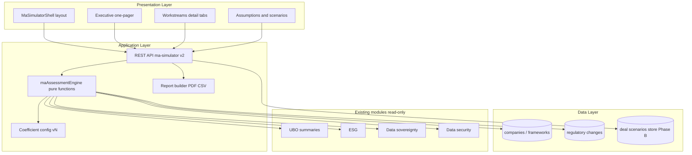

# M&A Simulator v2 — High-Level Implementation Plan

**Status:** Draft for engineering execution  
**Source architecture & reviews:** [m-a-simulator-v2-architecture-review.plan.md](plans/m-a-simulator-v2-architecture-review.plan.md) (full roadmap, M&A specialist, C-level, GRC Director reviews)  
**Aligned process:** Developer skill — Phase 1 (architecture) complete in source doc; this file operationalises **Phase 2 delivery** with solution architecture, UI/UX, and system design.

---

## 1. Purpose

Deliver a **planning-grade** M&A integration simulator: transparent **cost, time, and resource** drivers; **risk and RAID** visibility; outputs usable by **PMO, GRC, and executives** — without positioning the product as legal advice or regulatory approval.

---

## 2. Solution architecture (containers and responsibilities)

**Boundaries**

- **Engine** is deterministic: inputs + coefficients → JSON model. Optional LLM may **only** populate structured fields from uploads; it **must not** replace engine math (per ADR in source plan).
- **API** validates all inputs, returns **versioned** schema + **error taxonomy** (extend [ADR-103](../adr/ADR-103-api-contract-and-failure-mode-policy.md) pattern).

---

## 3. ADRs to add or extend (before coding)

| ADR | Topic | Decision outline |
|-----|--------|------------------|
| ADR-201 | M&A engine persistence | JSON file per tenant/parent vs SQLite — start JSON under `server/data/ma-scenarios/` with schema validation |
| ADR-202 | Coefficient governance | Versioned `ma-coefficients.json`; breaking change bumps major version; API returns `coefficientVersion` |
| ADR-203 | LLM boundary | If used: extraction endpoint separate; timeout 30s; fallback empty structured fields |
| ADR-204 | MNPI / RBAC | Scenario classified Restricted; align with existing role module gates in App |

---

## 4. System design

### 4.1 Data flow (generate assessment)

1. Client collects **deal parameters** (acquirer, target, structure, stake, complexity toggles) + optional **assumption overrides**.
2. Client attaches **module snapshots** (UBO, ESG, DS, Security) as today — with **freshness timestamp** in Phase B.
3. `POST /api/analysis/ma-simulator` (or **`/api/ma/v1/assessments`** if versioning split) sends JSON body + multipart optional file.
4. **Engine** loads frameworks for target from companies index; merges **regulatory velocity** from changes feed; computes **cost lines**, **phases**, **risk candidates**, **regulatory matrix rows**.
5. Response includes **`schemaVersion`**, **`methodologyNote`**, **`lineage`** (which fields from modules vs defaults).
6. **PDF/CSV** generated server-side from same model (single source of truth).

### 4.2 Core entities (logical model)

- **DealScenario**: id, parentGroup, target, dealType, stakePct, flags, assumptionOverrides, coefficientVersion, createdBy, updatedAt.
- **AssessmentResult**: scenario inputs hash + computed arrays (costBreakdown, phases, risks, regulatoryMatrix, valueBridge optional).
- **RiskItem**: id, category, inherent, residual, mitigation, owner, workstreamId, dueDate.
- **RegulatoryAction**: authority, actionType, framework, dueOffsetDays, dependsOn[].

### 4.3 API surface (high level)

| Method | Path | Purpose |
|--------|------|---------|
| POST | `/api/ma/v1/assessments` | Run engine (or evolve existing `ma-simulator`) |
| GET | `/api/ma/v1/assessments/:id` | Retrieve persisted scenario (Phase B) |
| GET | `/api/ma/v1/coefficients` | Active coefficient set (read-only for most roles) |
| POST | `/api/ma/v1/assessments/:id/export` | PDF/CSV async if large (Phase C) |

Errors: `400` validation, `403` RBAC, `404` scenario, `422` incomplete target data, `503` LLM unavailable — **no stack traces** in client JSON.

---

## 5. UI / UX design

### 5.1 Information architecture

| Surface | Primary audience | Content |
|---------|------------------|---------|
| **Executive one-pager** | CEO / CFO / Board pack | Net story: synergy band vs integration cost band; top 5 risks; appetite flags; cash bands; “conditions to proceed” |
| **Practitioner workspace** | Corp Dev, PMO, Compliance | Workstreams, full risk register, regulatory matrix, timelines, resources |
| **Assumptions drawer** | Finance, GRC | Sliders, coefficient version, assumption owners, methodology link |
| **GRC pack** | GRC Director | Inherent/residual, traceability, audit trail link, disclaimer |

**Progressive disclosure:** Default landing = **one-pager**; tabs for **Schedule**, **Costs**, **Risks**, **Regulatory**, **Assumptions**; drill-down “why” for every KPI.

### 5.2 Visual and interaction

- Reuse **Analysis** / app design tokens; avoid generic “AI chat” chrome.
- **Gantt-style** horizontal phases (weeks on axis); **stacked bar** for one-time vs annual cost.
- **Compare scenarios** (Phase B): split view or diff table.
- **Accessibility:** table sortable headers, keyboard focus on sliders, RTL-safe layout (existing app patterns).

### 5.3 Navigation option

- **A)** Dedicated `ma-simulator` view with sub-routes `/summary`, `/detail`  
- **B)** Keep under Analysis with **sticky sub-nav** for M&A vs Risk Predictor  
Recommend **A** if scope grows (per source plan §5).

---

## 6. Phased implementation (engineering)

### Phase A — MVP+ (8–12 weeks indicative)

| Workstream | Deliverables |
|------------|----------------|
| Backend | Extract `maAssessmentEngine` from `analysis.js`; `ma-coefficients.json` + Joi/Zod validation; extended response schema with risks, regulatory matrix, value bridge inputs (manual synergies); CSV export |
| Frontend | New `client/src/components/ma/` — `MaSimulator.jsx`, `ExecutiveSummary`, `RiskRegisterTable`, `RegulatoryMatrix`, `AssumptionPanel`; wire from `App.jsx` / `Analysis.jsx` |
| UX | Wireframes sign-off → build one-pager first |
| Tests | Unit tests for engine golden scenarios; contract test for JSON shape |
| Docs | Methodology appendix in PDF; disclaimer strings |

### Phase B — Persistence and governance

| Workstream | Deliverables |
|------------|----------------|
| Backend | Persist `DealScenario`; list/compare; audit fields; RBAC on parent |
| Frontend | Scenario list, diff, version badge |
| GRC | Source attribution table; assumption register owners |

### Phase C — Advanced

- Monte Carlo or scenario bands; webhooks; sector config packs; optional 2LoD attestation workflow.

---

## 7. Non-functional requirements

| Area | Requirement |
|------|----------------|
| Performance | Assessment POST p95 under 5s without LLM; 30s timeout with LLM |
| Security | MNPI scenarios; no IDOR on scenario/report IDs; upload size cap; sanitize filenames |
| Observability | Structured logs with `assessmentId`, `coefficientVersion`; no PII in logs |
| Resilience | Engine pure functions — unit-testable; external file read failures → 503 with message |

---

## 8. Testing strategy (Developer Phase 3 alignment)

- **Unit:** engine only — boundary inputs, empty frameworks, max frameworks stress.
- **Integration:** full POST with fixture `companies` data.
- **Contract:** snapshot JSON schema v1.
- **Security:** OWASP subset — authz on scenarios, upload abuse.
- **GRC acceptance:** map to GTC-GRC scenarios in architecture review §14.4.

---

## 9. Risks and mitigations

| Risk | Mitigation |
|------|------------|
| Model distrusted by IC | Published methodology + ranges + manual synergy inputs |
| Scope creep | Freeze Phase A backlog; Phase B+ gated |
| Coefficient drift | Versioned config + change log |

---

## 10. Open decisions (from source plan)

1. IC-grade economics in v1 vs compliance-led only — **product call**.  
2. Dedicated route vs Analysis sub-view — **UX call**.  
3. Model risk owner (Finance vs GRC) — **governance call**.

---

## 11. File checklist (repo)

| File | Role |
|------|------|
| [m-a-simulator-v2-architecture-review.plan.md](plans/m-a-simulator-v2-architecture-review.plan.md) | Full architecture + stakeholder reviews |
| This file | Implementation and delivery plan |

---

*This document does not constitute legal, tax, or regulatory advice.*
