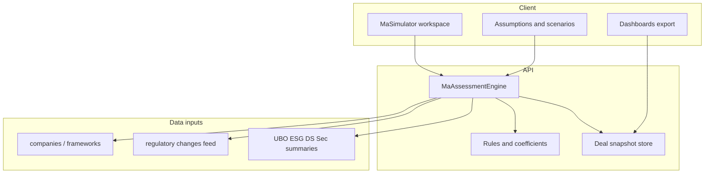

# M&A Simulator — Architecture and Roadmap (Review)

## 1. Business outcome (problem statement)

**Outcome:** Give the **parent organization** a defensible, **pre-commit view** of what it will take—**calendar time, internal effort (FTE/roles), external spend, regulatory drag, and material risks**—to absorb a target (OpCo or peer group) under a chosen acquirer, so leadership can align **cost planning**, **program planning**, and **risk treatment** before signing.

**Non-goals for v1:** Full legal advice, guaranteed regulatory approval, automated deal valuation, or replacing VDR/diligence platforms.

---

## 2. Current implementation (as-is)

| Layer  | What exists today                                                                                                                                                                                                                                                                                                                                                                                                                                                                   |
| ------ | ----------------------------------------------------------------------------------------------------------------------------------------------------------------------------------------------------------------------------------------------------------------------------------------------------------------------------------------------------------------------------------------------------------------------------------------------------------------------------------- |
| UI     | `[client/src/components/Analysis.jsx](client/src/components/Analysis.jsx)` — `ma-simulator` view: Parent Group + Target dropdowns, optional document upload, “Generate assessment.” Enriches POST with UBO/ESG/data sovereignty/security summaries and optional risk heat-map row from **Risk Predictor** (must run prediction first for best target row match).                                                                                                                    |
| API    | `[server/routes/analysis.js](server/routes/analysis.js)` — `POST /api/analysis/ma-simulator`: reads `[server/data/companies.json](server/data/companies.json)` (or equivalent path used in file) for **frameworks** tied to target; builds **fixed** cost heuristics (e.g. legal/compliance/IT one-time, FTE from framework count, annual audit); **DEFAULT_COMPLIANCE_DAYS** timelines; generic **systemIntegrations** list; **timeModel** phases; PDF via `buildMaAssessmentPdf`. |
| Output | JSON + downloadable PDF; in-memory `maReportStore` with TTL (~1h).                                                                                                                                                                                                                                                                                                                                                                                                                  |

**Gaps vs stated ambition:** Numbers are **not traceable** to user-tunable assumptions; **no risk register** (severity, likelihood, owner); **no resource model** (roles, ramp, concurrency); **no scenario/sensitivity**; **no export** to planning tools; **deal type** (asset vs share, % stake) not modeled; **integration** with existing modules is **read-only snippets** rather than a structured “deal record.”

---

## 3. Domain model (M&A specialist lens)

Structure the product around **standard integration workstreams** (customize labels for GCC/regulatory context):

```mermaid
flowchart LR
  subgraph deal [Deal definition]
    Acquirer[Acquirer group]
    Target[Target entity]
    DealType[Deal type stake]
  end
  subgraph streams [Integration workstreams]
    Reg[Regulatory and licensing]
    AML[AML/CFT and UBO]
    Data[Data and DP]
    IT[IT and cyber]
    HR[HR and payroll]
    Tax[Tax and transfer pricing]
    Gov[Corporate governance]
  end
  subgraph outputs [Planning outputs]
    Cost[Cost model]
    Res[Resource plan]
    Sched[Schedule and milestones]
    Risk[Risk register]
  end
  deal --> streams
  streams --> outputs
```

**Deal parameters** (minimum to make outputs credible):

- **Structure:** share deal vs asset deal; **effective stake** (100% vs partial); **closing assumption** (signing vs legal close vs Day-1 operations).
- **Complexity multipliers:** number of **entities/jurisdictions**, **regulated** vs non-regulated target, **cross-border** data, **headcount** band (optional), **known carve-outs** (e.g. outsourcing caps).

**Risk taxonomy** (examples): regulatory notification / change-of-control; licence continuity; **AML** programme merge; **data localisation**; **cyber** integration; **employee transfer** (where applicable); **third-party** consent; **audit** remediation. Each risk: **category**, **description**, **impact** (cost/time), **mitigation**, **residual** rating.

**Cost model** should separate **one-time** vs **run-rate**, **internal** vs **external**, and show **assumption sliders** (not a single black-box total).

---

## 4. Solution architecture (high level)

**ADR-level decisions** (to confirm before build):

| Topic       | Options                                                       | Recommendation                                                                                                                                                         |
| ----------- | ------------------------------------------------------------- | ---------------------------------------------------------------------------------------------------------------------------------------------------------------------- |
| Persistence | A) Ephemeral only B) Server JSON/DB per deal                  | **B)** named “deal scenarios” for parent org (audit, revisit)                                                                                                          |
| Cost engine | A) Pure heuristics B) Heuristics + editable coefficients      | **B)** coefficients in config (e.g. `[server/config/ma-coefficients.json](server/config/ma-coefficients.json)`) versioned                                              |
| LLM role    | A) Generate prose only B) Structure extraction only C) No LLM | **B)** optional: extract **structured** fields from uploaded LOI/SPA outline; **never** replace deterministic math; prose = short exec summary **templated** by humans |
| Exports     | PDF only                                                      | PDF + **CSV** (cost lines, risks, milestones) + optional **ICS** milestones                                                                                            |

---

## 5. UX principles (human, not “AI boilerplate”)

- **Progressive disclosure:** Executive **one-screen summary** (total weeks band, one-time vs annual cost band, top 5 risks, confidence label); **tabs** for Workstreams, Schedule, Costs, Risks, Assumptions.
- **Transparency:** Every headline number links to **“why”** — drivers, formulas in plain language (“+2 regulators → +X weeks in notification track”).
- **Language:** Written for **CFO / Head of Compliance / PMO**, not chatbot tone; avoid filler “AI-generated” badges unless a specific LLM step ran.
- **Visual system:** Reuse app tokens from `[client/src/styles](client/src/styles)` and `[Analysis.css](client/src/components/Analysis.css)`; add **Gantt-style** phase chart and **resource histogram** (simple bars first).
- **Separate entry:** Consider dedicated route/view `**MaSimulator`** (or prominent sub-nav under Analysis) so the feature can grow without crowding Risk Predictor—implementation detail to confirm.

---

## 6. Feature backlog (phased)

### Phase A — Planning-grade core (MVP+)

- **Deal scenario form:** deal type, stake %, target complexity inputs, toggles for regulated target / multi-entity.
- **Assumption-driven engine:** replace fixed `oneTimeLegal` constants with **formula + coefficients**; expose sliders in UI with **snapshots** (baseline vs conservative).
- **Risk register:** generated from framework mix + deal parameters + optional doc extraction; sortable table; link risks to **workstreams**.
- **Resource model:** roles (e.g. Legal, Compliance, PMO, IT) × **FTE-months** per phase; clarify overlap with current `fteEstimate` string.
- **Schedule:** dependency-aware phases (not only additive weeks); critical path narrative.
- **Exports:** CSV + improved PDF narrative (methodology footnote).

### Phase B — Integration and governance

- **Persisted scenarios** per parent org; **compare** two scenarios side-by-side.
- **Pull structured inputs** from existing modules where IDs match (UBO, ESG, Data Sovereignty, Security) — show **data freshness** and **gaps**.
- **Audit trail** of who changed assumptions (if auth exists; else local versioning).

### Phase C — Advanced (optional)

- **Monte Carlo** or **range** on duration (probability-weighted bands), driven by discrete risk events.
- **API webhooks** or email summary for leadership.
- **Integration templates** by sector (banking vs non-bank) from config packs.

---

## 7. External inspiration (partial analogues)

Use as **patterns**, not clones:

- **M&A / deal pipeline CRMs** (e.g. DealCloud-style): deal stages, probabilities, accountability.
- **Virtual data rooms** (e.g. Ansarada, Intralinks): diligence **workstreams**, risk logs, Q&A discipline — we mirror **structure**, not file hosting.
- **Integration management** (PMO tools): **work breakdown**, milestones, **RAID** logs (Risks, Assumptions, Issues, Dependencies).
- **Regulatory change** alignment: your existing **governance framework** and **change feed** are differentiators — surface “**regulatory velocity**” (recent change count / criticality) as an input to timeline stress.

---

## 8. Security and data sensitivity

- Treat uploaded deal docs as **confidential**: size limits, virus scan policy (if not already), **no** long-term storage of raw binaries without explicit requirement; prefer **extracted structured JSON** + retention policy.
- **RBAC:** restrict M&A scenarios to same **parent / role** model as rest of app (`[App.jsx](client/src/App.jsx)` patterns).

---

## 9. Testing and review gates (Phase 2 when building)

- **Golden scenarios:** 2–3 fixed parent/target pairs with expected **ranges** for cost/weeks.
- **Unit tests** for pricing/timeline functions (pure functions in `server/services/maAssessmentEngine.js` or similar).
- **Contract tests** for `POST /api/analysis/ma-simulator` response schema (version field).

---

## 10. Suggested deliverables for “review” checkpoint

1. **Stakeholder sign-off** on deal parameters (Phase A) and persistence (Phase B).
2. **Coefficient sheet** (business): default AED rates, FTE-weeks per workstream — owned by product/compliance, not only engineering.
3. **Wireframes** (low-fi): Executive summary + Assumptions drawer + Risk register — before heavy UI polish.

---

## 11. Key files to evolve (implementation pointer)

- Frontend: new or refactored components under e.g. `client/src/components/ma/`; reduce `[Analysis.jsx](client/src/components/Analysis.jsx)` bulk by extraction.
- Backend: split `[server/routes/analysis.js](server/routes/analysis.js)` M&A block into `**server/services/maAssessmentEngine.js`** + thin route; add `**server/routes/maScenarios.js`** if persisting deals.
- Config: `**server/config/ma-coefficients.json`** (+ schema validation).

---

## 12. Independent review — M&A specialist lens (Reviewer skill)

**Scope of this review:** The **plan document** only (not implemented code). **Lens:** Corporate development / M&A advisory and **post-merger integration (PMI)** practice — what a specialist needs to see to support IC memos, synergy cases, regulatory filings narrative, and integration budgets.

**Context assembly (Reviewer R0):**

| Artifact                                                 | Status                                              |
| -------------------------------------------------------- | --------------------------------------------------- |
| Original brief (brilliant M&A simulator)                 | Present in §1                                       |
| Architecture / ADRs                                      | Partial (§4) — **no API schema, no error taxonomy** |
| Security / multi-tenant                                  | §8 high-level only                                  |
| Edge cases / empty states                                | **Missing**                                         |
| Test plan                                                | §9 minimal                                          |
| **M&A-specific: deal thesis, synergies, CPs, approvals** | **Missing from plan** — see §12.2                   |

**Overall:** The plan is a strong **regulatory/compliance integration** scaffold. For a **general M&A specialist**, it must explicitly add **deal economics**, **approval gates**, **synergy/value bridge**, and **PMI operating model** data — or the product remains a “compliance integration estimator” rather than a full pre-commit M&A view.

---

### 12.1 Findings on the plan (findings register — plan phase)

| ID         | Severity    | Title                                | Description                                                                                                                               | Recommendation                                                                                                                                 |
| ---------- | ----------- | ------------------------------------ | ----------------------------------------------------------------------------------------------------------------------------------------- | ---------------------------------------------------------------------------------------------------------------------------------------------- |
| REV-MA-001 | HIGH        | No deal economics layer              | Plan focuses on compliance cost/time but not **purchase mechanics** (EV/Equity, consideration mix, debt-like items), limiting CFO/IC use. | Add optional fields: **transaction value band**, **funding source**, **fee budget line** (advisory, legal, DD) separate from integration Opex. |
| REV-MA-002 | HIGH        | Synergies and value bridge absent    | M&A specialists anchor narratives on **synergy case** (cost vs revenue, phasing, probability). Plan mentions “value” only indirectly.     | Add **synergy module** (even if manual inputs): target savings by year, one-time capture costs, **risk-adjusted** toggle.                      |
| REV-MA-003 | MEDIUM      | Regulatory story incomplete          | “Frameworks” are listed; real deals need **which filings**, **which authorities**, **notification vs approval**, **timing bands**.        | Map frameworks → **authority × action × calendar band** (notification 30–60d vs approval 90–180d).                                             |
| REV-MA-004 | MEDIUM      | No condition precedents / milestones | PMI runs on **CP satisfaction** and **Day-1 / Day-100** gates.                                                                            | Add **milestone types**: signing, closing, Day-1, first regulatory submission, licence continuity.                                             |
| REV-MA-005 | MEDIUM      | HR / people integration thin         | Only “HR/payroll” system line; no **TUPE-like** / **local labour** risk, **retention**, **key person** dependency.                        | Data points: **headcount**, **union/works council** Y/N, **retention pool** assumption.                                                        |
| REV-MA-006 | MEDIUM      | Tax and legal entity structure       | No **holding structure** post-close, **transfer pricing** trigger, **VAT/group** simplification.                                          | Add optional **tax workstream** inputs: jurisdictions of tax residence, **asset deal** tax step-up flag.                                       |
| REV-MA-007 | LOW         | Vendor / carve-out                   | No **TSA** (transitional services agreement) or **separation** cost if carve-out.                                                         | Flag carve-out / **TSA months** as optional driver of cost and time.                                                                           |
| REV-MA-008 | OBSERVATION | Methodology disclaimer               | Any model must state **not legal/tax advice** and **ranges** not point estimates.                                                         | Fixed footer in PDF/UI + **confidence interval** on totals.                                                                                    |

---

### 12.2 Required data points — M&A specialist data dictionary

Below: fields a **corporate development / PMI lead** typically reviews. Mark **P** = plan already covers partially, **G** = gap to add, **O** = optional / advanced.

#### A. Deal identification and governance

| Data point                                                       | Purpose                                            | P/G/O |
| ---------------------------------------------------------------- | -------------------------------------------------- | ----- |
| Deal / scenario name, version, owner, last updated               | Audit, compare scenarios                           | G     |
| Acquirer (parent group) legal name vs display name               | Alignment with filings                             | P     |
| Target entity name(s), **LEI** or reg ID if available            | Precision in regulator comms                       | G     |
| **Stake %** (current → post-close)                               | Control tests, consolidation, regulator thresholds | G     |
| **Deal structure**: share acquisition / asset deal / merger / JV | Drives tax, employment, licences                   | G     |
| **Signing date** / **target closing** (optional)                 | Timeline anchor                                    | G     |
| **Jurisdictions of operation** (countries + free zones)          | Multi-regulator map                                | P     |
| **Deal stage**: exploratory / LOI / DD / signed / closed         | What numbers mean                                  | G     |
| **IC / board approval** status (Y/N/date)                        | Governance                                         | O     |

#### B. Transaction economics and fees (CFO / Corp Dev)

| Data point                                             | Purpose                             | P/G/O |
| ------------------------------------------------------ | ----------------------------------- | ----- |
| **Enterprise value** or value band (optional)          | Scale of integration vs deal size   | G     |
| **Transaction / advisory fees** budget (legal, FA, DD) | Separate from **integration** spend | G     |
| **Financing** assumption: cash vs debt vs equity       | Cash cost timing                    | O     |
| **Working capital** / completion mechanism flag        | Post-close noise                    | O     |
| **Synergy target** (annual run-rate, by category)      | Value story                         | G     |
| **Synergy phasing** (Y1/Y2/Y3)                         | PMI planning                        | G     |
| **One-time synergy capture cost**                      | Net value bridge                    | G     |

#### C. Regulatory and licensing (aligned with current product)

| Data point                                                          | Purpose           | P/G/O |
| ------------------------------------------------------------------- | ----------------- | ----- |
| Applicable **frameworks** per entity                                | Already in plan   | P     |
| **Regulator / authority** per framework                             | Who to notify     | G     |
| **Action type**: notification / approval / registration / variation | Timeline driver   | G     |
| **Statutory / guideline** deadline references (optional)            | Defensibility     | O     |
| **Change-of-control** / **suitability** review required (Y/N)       | Banking/insurance | G     |
| **Licence continuity** vs new licence                               | Operational risk  | G     |
| **Conditional approval** risk (material adverse)                    | Risk register     | G     |

#### D. Compliance integration (current strength — extend)

| Data point                                                        | Purpose            | P/G/O |
| ----------------------------------------------------------------- | ------------------ | ----- |
| AML/CFT programme **merge** vs **parallel run**                   | Effort and time    | G     |
| **UBO register** alignment (group vs target)                      | Your UBO module    | P     |
| **Sanctions** / screening consolidation                           | System integration | P     |
| **Data protection**: PDPL roles (controller/processor) post-close | DPO workload       | G     |
| **Esg** posture and **mandatory** disclosure gaps                 | Your ESG module    | P     |

#### E. Tax and legal entity

| Data point                                          | Purpose         | P/G/O |
| --------------------------------------------------- | --------------- | ----- |
| **Asset vs share** step-up implications (flag)      | Tax/valuation   | G     |
| **Transfer pricing** documentation refresh required | Ongoing cost    | G     |
| **VAT grouping** / invoice flow change              | Working capital | O     |
| **IP** assignment needs                             | Legal timeline  | O     |

#### F. People and HR

| Data point                                           | Purpose                 | P/G/O |
| ---------------------------------------------------- | ----------------------- | ----- |
| **Headcount** (target)                               | PMI scale               | G     |
| **Key roles** retention risk (count or band)         | Integration risk        | G     |
| **Union / collective agreement**                     | Timeline / consultation | G     |
| **Benefits harmonisation** complexity (low/med/high) | HR FTE                  | G     |
| **Immigration** / visa for seconded staff            | GCC-relevant            | O     |

#### G. Technology and operations

| Data point                                        | Purpose                      | P/G/O            |
| ------------------------------------------------- | ---------------------------- | ---------------- |
| **Core systems** count (ERP, core banking, HRIS)  | Integration list credibility | P (generic list) |
| **Cyber** posture grade / open critical findings  | Your security module         | P                |
| **Outsourcing** / **critical outsourcer** consent | Regulator                    | G                |
| **Data migration** scope (TB / systems)           | IT effort                    | G                |
| **TSA** duration if carve-out                     | Cost + time                  | O                |

#### H. Risks, assumptions, dependencies (RAID)

| Data point                                                                                   | Purpose                | P/G/O |
| -------------------------------------------------------------------------------------------- | ---------------------- | ----- |
| **Risk**: description, category, **likelihood**, **impact**, owner, mitigation, **residual** | Standard risk register | G     |
| **Assumptions** (explicit list): e.g. “no new regulation in 12m”                             | Sensitivity            | G     |
| **Issues** (open DD items)                                                                   | Not same as risk       | O     |
| **Dependencies**: e.g. “licence X before data migration”                                     | Critical path          | G     |

#### I. Schedule and resources

| Data point                                                  | Purpose       | P/G/O |
| ----------------------------------------------------------- | ------------- | ----- |
| **Phases** with dependencies (not only additive weeks)      | Critical path | G     |
| **FTE by role** × **phase** × **month**                     | Resourcing    | G     |
| **External spend** by category × quarter                    | Cash planning | G     |
| **Milestones**: signing, closing, **Day-1**, **Day-30/100** | PMI norms     | G     |

#### J. Outputs for downstream tools

| Data point / export shape                       | Purpose       | P/G/O |
| ----------------------------------------------- | ------------- | ----- |
| **CSV** cost lines + risks + milestones         | FP&A, PMO     | P     |
| **PDF** with methodology appendix               | IC pack annex | P     |
| **Microsoft Project / Smartsheet**-friendly CSV | Optional      | O     |

---

### 12.3 Suggested plan updates (merge into §6 backlog)

- **Phase A additions:** Minimum viable **deal economics** block (value band optional, synergy inputs manual), **authority × action** matrix from framework list, **RAID** section (assumptions + dependencies), **headcount** and **regulated entity** toggles, **methodology** disclaimer.
- **Phase B additions:** **Synergy vs integration cost** waterfall chart; **scenario compare** includes deal stage and funding.
- **Phase C additions:** **Probability-weighted** synergy (optional); **TSA** month driver.

---

### 12.4 Questions requiring answers before build (Reviewer → Product)

1. **Primary buyer persona:** Is this tool **compliance-led PMI** only, or must it support **IC memo**-grade economics (EV, synergies) in v1?
2. **Materiality threshold:** Should regulators and costs **scale** with deal size bands, or remain compliance-only?
3. **Data residency:** Will deal scenarios be **persisted** with PII (headcount ranges OK?) — affects encryption and retention design.
4. **Who owns coefficients:** Legal, Finance, or Compliance for **default** integration cost rates?

---

### 12.5 Review scorecard (this plan document)

| Dimension                            | Verdict                                                                                   |
| ------------------------------------ | ----------------------------------------------------------------------------------------- |
| Business alignment (M&A generalist)  | **CONDITIONAL** — strong on regulatory integration; add economics + synergies + approvals |
| Functional completeness (data model) | **CONDITIONAL** — §12.2 closes gap                                                        |
| Technical architecture               | **PASS** at concept level — pending API/schema                                            |
| Security                             | **CONDITIONAL** — §8 needs detail when persisting deal data                               |
| Test / documentation                 | **CONDITIONAL** — golden scenarios must include M&A fields                                |

**Reviewer verdict on plan:** **CONDITIONAL PASS** — approve direction; incorporate §12.1–12.3 into Phase A/B scope before implementation sign-off.

---

## 13. Independent review — C-level (Board / CEO / CFO / CRO) perspective

**Lens:** Executive decision-making on **capital allocation** and **material risk**. C-level does not need line-item regulatory tasks; they need **conclusions**, **ranges**, **trade-offs**, and **accountable owners**—with enough drill-down to trust the numbers.

**Context assembly (Reviewer R0):** This section reviews the **plan** for whether the eventual product can support **go / no-go / proceed with conditions** decisions—not line-code review.

---

### 13.1 What C-level must see to assess outcomes (go / no-go inputs)

A credible executive view combines **value**, **cost**, **time**, **risk**, and **governance**. The plan must explicitly surface:

| Theme                          | Data / insight C-level expects                                                                                                                                | Plan status (§6 / §12)                       |
| ------------------------------ | ------------------------------------------------------------------------------------------------------------------------------------------------------------- | -------------------------------------------- |
| **Strategic fit**              | Why this target; 2–3 bullet **thesis** (optional user field); alignment with group strategy                                                                   | **G** — not in plan                          |
| **Value & payback**            | **Synergy** (run-rate) vs **integration + compliance** one-time + annual; **simple payback** or **years to break-even on integration spend** (even if banded) | **G** — synergies partial in §12             |
| **Total cash impact**          | **Transaction** costs (fees) **separate from** **post-close integration** (Opex/Capex); **12–24 month cash curve** (quarterly buckets)                        | **G**                                        |
| **Capital intensity**          | Whether integration requires **Capex** (systems) vs **Opex** only; **budget envelope** vs board limit                                                         | **G**                                        |
| **Time to stability**          | **Time to Day-1** vs **time to “steady regulatory state”** (not one number); **critical path** in plain English                                               | **P** — timeModel exists; needs exec summary |
| **Material risks**             | Top **5–7** risks with **financial or licence** consequence; **regulatory show-stoppers** called out                                                          | **P** — risk register planned                |
| **Reversibility / worst case** | What happens if approval delayed 6–12 months (cost of delay); **no-go triggers**                                                                              | **G**                                        |
| **Confidence**                 | **Ranges** + **assumptions** + “what would move us from base to stress case”                                                                                  | **P** — sliders planned                      |
| **Accountability**             | **Named workstream owners** (functional), not just “Compliance”                                                                                               | **G**                                        |
| **Governance**                 | What **board / IC / RCC** needs in the pack (one PDF page + appendix)                                                                                         | **G**                                        |

**Go / no-go is rarely a single metric.** Executives decide on **bundles**: acceptable risk **given** synergy case **and** funding **and** timeline **and** reputational exposure.

---

### 13.2 Findings — plan gaps from a C-level perspective (findings register)

| ID          | Severity    | Title                               | Description                                                                                                                   | Recommendation                                                                                                                                                                              |
| ----------- | ----------- | ----------------------------------- | ----------------------------------------------------------------------------------------------------------------------------- | ------------------------------------------------------------------------------------------------------------------------------------------------------------------------------------------- |
| REV-CXO-001 | HIGH        | No executive “one-pager” in plan    | Plans describe tabs and exports but not a **mandatory first screen**: headline numbers, traffic-light risk, decision framing. | Add **§6 / UX**: “C-level summary” view: **total integration cost band**, **annual run-rate**, **weeks to key milestones**, **top 5 risks**, **synergy vs cost** bar, **confidence** label. |
| REV-CXO-002 | HIGH        | Synergy vs cost bridge missing      | CFOs decide on **net** story; compliance-only costs without **synergy line** (even manual) weakens go/no-go.                  | Require **value bridge** (manual inputs Phase A): synergies, capture cost, integration Opex—show **net** band.                                                                              |
| REV-CXO-003 | MEDIUM      | No “decision thresholds”            | Execs ask: “Above what cost do we escalate to board?” Plan has no **materiality** hooks.                                      | Add optional **thresholds** (config): e.g. total integration > X AED → flag; **regulatory** change-of-control → always red flag.                                                            |
| REV-CXO-004 | MEDIUM      | Cash timing not quarterly           | Annual + one-time is not enough for **liquidity** discussions.                                                                | **Cash curve** by quarter (even coarse) in Phase B.                                                                                                                                         |
| REV-CXO-005 | MEDIUM      | Reputational / conduct risk thin    | CRO cares about **conduct**, **AML**, **data breach**—partially covered via modules; not framed as **enterprise risk**.       | Risk register: tag **enterprise** vs **operational**; surface **CRO-relevant** rows in summary.                                                                                             |
| REV-CXO-006 | LOW         | No explicit “conditions to proceed” | IC often approves **subject to** DD outcomes.                                                                                 | Support **conditions** list (checklist) linked to go/no-go.                                                                                                                                 |
| REV-CXO-007 | OBSERVATION | Narrative quality                   | C-level rejects “AI slop”; they want **tight** narrative **templates** written by domain experts.                             | §5 already says human tone; add **fixed exec summary template** (non-LLM or lightly templated).                                                                                             |

---

### 13.3 Key action items C-level expects from this output (not features—outcomes)

Executives do not “use sliders daily”; they **consume outputs** and **assign actions**. The product should produce:

| Action artefact                                     | Owner (typical)        | Purpose                                                                                                                                              |
| --------------------------------------------------- | ---------------------- | ---------------------------------------------------------------------------------------------------------------------------------------------------- |
| **Decision recommendation line**                    | CEO / deal sponsor     | One sentence: “Proceed / Proceed with conditions / Do not proceed” **based on user-defined thresholds** (tool assists, does not replace governance). |
| **Top 5 risks with mitigations + owner + due date** | CRO / CCO              | Board / RCC follow-up.                                                                                                                               |
| **Integration budget envelope** for FP&A            | CFO                    | Feed **annual plan** and **capital** requests.                                                                                                       |
| **90-day / 12-month integration roadmap headline**  | COO / PMIO             | Align **operating plan** and hires.                                                                                                                  |
| **Regulatory notification calendar**                | CCO / GC               | **When** to file what; **sequencing** vs closing.                                                                                                    |
| **Synergy tracking baseline**                       | CFO                    | Post-close **value capture** scorecard (if scenario persisted).                                                                                      |
| **Escalation triggers**                             | Board secretary / risk | When metrics breach thresholds.                                                                                                                      |

**Plan update:** Add **§6** bullet: “**Executive outputs pack**: PDF page 1 = decision framing + numbers + risks + owners; pages 2+ = detail.”

---

### 13.4 Day-to-day usage — how C-level actually engages (vs working teams)

| Frequency               | C-level behaviour                                                   | What the tool must support                                                                             |
| ----------------------- | ------------------------------------------------------------------- | ------------------------------------------------------------------------------------------------------ |
| **Ad hoc (deal peak)**  | 30–60 min review before IC / board; comparison of **two scenarios** | **Side-by-side** scenarios; **print/PDF** one-pager; **no login friction** to retrieve saved scenario  |
| **Monthly / quarterly** | Portfolio or **post-mortem** on integration burn vs plan            | Persisted scenarios; **variance** “planned vs actual” (Phase C—needs external actuals or manual entry) |
| **Delegation**          | CFO / CCO **own** the model; CEO scans summary                      | **Role-based views**: exec summary vs practitioner detail (already in §5)                              |
| **Day-to-day**          | Executives **do not** tune assumptions daily; **PMO / Corp Dev** do | **Collaboration**: named scenario owner, **comments** or **export to email** for steering committees   |

**Important:** Position the product as **decision support**, not **autopilot**. C-level “day-to-day” is **steering committee rhythm** (weekly/fortnightly during integration), not daily data entry.

---

### 13.5 Destructive questions — C-level will ask (plan must answer in UX copy)

1. **“What is the total cost of being wrong?”** — Stress case and **downside** band (§12 assumptions).
2. **“What stops us operating on Day 1?”** — Explicit **licence / critical path** answer on summary.
3. **“What do we tell the regulator and when?”** — Authority × action timeline (§12.2 C).
4. **“How does this hit EPS / cash in year 1?”** — Needs **synergy + cost** in same view (REV-CXO-002).
5. **“Who owns fixing the top risk?”** — Owner field on risks (§12.2 H).

---

### 13.6 Review scorecard — C-level readiness of this **plan document**

| Dimension                                 | Verdict                                                                             |
| ----------------------------------------- | ----------------------------------------------------------------------------------- |
| Business alignment (C-suite go/no-go)     | **CONDITIONAL** — add executive one-pager, value bridge, cash/liquidity story       |
| Actionability (owners, thresholds, packs) | **CONDITIONAL** — §13.3 must map to backlog                                         |
| Functional completeness (exec data)       | **CONDITIONAL** — overlaps §12.2; C-level subset must be **first-class** in UX spec |

**Reviewer verdict (C-level):** **CONDITIONAL PASS** — incorporate §13.1–13.3 into Phase A UX and data model; treat **executive summary** and **net value bridge** as **non-optional** for “brilliant” C-level outcomes.

---

### 13.7 Questions for Product (C-level closure)

1. Will **IC / board** accept **modelled ranges** from this tool, or only **qualitative** support to external advisory numbers?
2. Is **CEO** the primary reader of the one-pager, or **CFO** first—who sets the **tone** of the summary?
3. Should **go / no-go** remain **entirely human-decided** (recommended) with the tool only surfacing **signals**—explicitly in UI legal copy?

---

## 14. Independent review — GRC Director perspective (Governance, Risk & Compliance)

**Lens:** Head of GRC / Chief Compliance Officer operating as **second line of defence (2LoD)** — accountable to the Board / Risk Committee for **risk oversight**, **regulatory integrity**, **conduct**, and **assurance** that the group can **absorb** the target without breaching **risk appetite**, **licence conditions**, or **group policies**. Not the same as “compliance checklist completion” (first line) or internal audit (third line).

**Context assembly (Reviewer R0):** This section reviews the **plan** for **GRC-grade defensibility** of outputs: traceability, proportionality, auditability, and **regulatory narrative** coherence.

---

### 14.1 What a GRC Director must see for a “watertight” outcome

| Theme                           | What GRC must understand                                                                                                        | Plan / §12–13 coverage                            | Gap                                                                                                         |
| ------------------------------- | ------------------------------------------------------------------------------------------------------------------------------- | ------------------------------------------------- | ----------------------------------------------------------------------------------------------------------- |
| **Risk appetite & tolerance**   | Does the deal push **residual risk** outside **approved appetite** (by risk type: operational, regulatory, conduct, financial)? | Not explicit                                      | **G** — add **appetite bands** or **traffic-light** vs group limits (even manual/config).                   |
| **Obligation traceability**     | Every **material regulatory obligation** post-deal is **mapped** to owner, **timeline**, **evidence** type                      | Frameworks + processes partial                    | **G** — **control ID** or **obligation ID** trace (framework → obligation → control → owner).               |
| **Residual risk**               | **Inherent** vs **mitigated** risk; what **remains** after integration plan                                                     | Risk register planned; no inherent/residual split | **G** — **inherent / residual** + **mitigation** effectiveness note.                                        |
| **Regulatory engagement**       | **Which authority**, **what filing**, **when**, **approval vs notification**                                                    | §12.2 C partially                                 | **G** — **regulatory engagement matrix** as first-class output.                                             |
| **AML / ABC / sanctions**       | **Programme merge** path; **EDD** for new entities; **sanctions** ownership                                                     | UBO / AML mentions                                | **G** — explicit **AML workstream** outcomes (merge vs parallel) and **sanctions** consolidation milestone. |
| **Data protection & conduct**   | **PDPL** roles, **cross-border** transfers, **customer** comms, **complaints** spike risk                                       | Data sovereignty / security summaries             | **G** — **DPIA / RoPA** trigger flags (even “required Y/N”).                                                |
| **Third parties & outsourcing** | **Material outsourcers**; **regulator consent**; **TSA** exit                                                                   | §12.2 G partial                                   | **G** — **outsourcing / critical vendor** row in risk + timeline.                                           |
| **Governance & policy**         | Target’s **policies** vs **group** standards; **board** composition / **independence** where relevant                           | Thin                                              | **G** — **policy harmonisation** effort band (low/med/high).                                                |
| **Assurance & audit**           | What **internal audit** will test post-close; **regulatory exam** readiness                                                     | Not in plan                                       | **O** — **assurance plan** outline (what gets tested in Y1).                                                |
| **Evidence & records**          | **Retention**, **audit trail** of scenario changes, **export** for **exam**                                                     | Persistence §4                                    | **G** — **immutable version history** + **who changed assumptions**.                                        |
| **Conduct & culture**           | **Integration** conduct risk (sales practices, mis-selling)                                                                     | Not in plan                                       | **O** — **conduct risk** line in register.                                                                  |
| **Board / committee narrative** | **2LoD opinion**-ready summary: “Within appetite / Not / Conditional”                                                           | C-level §13                                       | **G** — **GRC summary paragraph** template + **conditions**.                                                |

---

### 14.2 Findings — plan gaps (GRC Director) — findings register

| ID          | Severity    | Category                | Title                       | Description                                                                                                            | Recommendation                                                                                                                     |
| ----------- | ----------- | ----------------------- | --------------------------- | ---------------------------------------------------------------------------------------------------------------------- | ---------------------------------------------------------------------------------------------------------------------------------- |
| REV-GRC-001 | HIGH        | Business / Architecture | No risk appetite linkage    | Outputs are **absolute** costs/risks without comparison to **group risk appetite** or **compliance risk tolerance**.   | Add **configurable thresholds** (or import from risk framework) and **breach flags** on summary.                                   |
| REV-GRC-002 | HIGH        | Documentation           | No 2LoD / 3LoD boundary     | Plan does not state whether outputs are **first-line delivery plans** vs **second-line challenge** artefacts.          | Document in **§4 ADR**: tool = **decision support**; **2LoD** signs off **separately**; optional **attestation** workflow Phase B. |
| REV-GRC-003 | HIGH        | Data integrity          | Traceability of numbers     | Coefficients change outputs; plan lacks **versioned methodology** and **source** for each line (module vs assumption). | **Methodology appendix** + **data lineage** table: “UBO ← module X”, “Cost line ← coefficient v2”.                                 |
| REV-GRC-004 | MEDIUM      | Functional              | Control taxonomy missing    | “Processes” are narrative; regulators and IA expect **controls** mappable to **testing**.                              | Map key processes to **control objectives** (CO) IDs; export for **RCSA** alignment.                                               |
| REV-GRC-005 | MEDIUM      | Security                | Deal data classification    | M&A scenarios may include **MNPI**; plan §8 mentions confidentiality but not **classification** or **need-to-know**.   | **Label** scenarios (e.g. Restricted); **RBAC** + **no over-sharing** in exports.                                                  |
| REV-GRC-006 | MEDIUM      | Operational             | Regulatory change velocity  | §7 mentions regulatory velocity; GRC needs **forward-looking** “**pending** law” exposure for target jurisdictions.    | Link to **changes feed** + **horizon** flag for **near-term** regulatory change.                                                   |
| REV-GRC-007 | MEDIUM      | Business                | Issue / finding management  | Risks without **issue log** linkage can drift.                                                                         | Optional **link** to corporate **issue** ID or export ID for **tracking**.                                                         |
| REV-GRC-008 | LOW         | Testing                 | GRC acceptance tests absent | Plan §9 has golden scenarios; no **GRC sign-off** criteria.                                                            | Add **§14.4** acceptance themes; automate where possible post-build.                                                               |
| REV-GRC-009 | OBSERVATION | Legal                   | Disclaimer scope            | GRC will insist **not legal advice** / **not regulatory approval**.                                                    | **Fixed disclaimer** on every PDF and exec view (§13 + legal review).                                                              |

---

### 14.3 Data outcomes GRC must receive (add to §12.2 / exports)

Structured outputs (minimum for **watertight** GRC pack):

1. **Risk register (extended):** ID, **risk category** (regulatory / conduct / operational / financial), **inherent** rating, **controls** (summary), **residual** rating, **owner (1LoD)**, **2LoD challenger** (optional field), **target date**, **status**.
2. **Regulatory plan:** Authority × **action** × **due** × **dependency** on **closing**.
3. **Obligation/control heatmap:** Framework × **material obligations** × **evidence** expected.
4. **Assumption register:** Every **slider/coefficient** listed with **owner** and **review frequency** (for model governance).
5. **Version history:** Scenario **v1 / v2**, **who**, **when**, **what changed** (audit).
6. **Source attribution:** Which fields came from **system modules** (UBO, ESG, DS, Security) vs **user input** vs **model default**.

---

### 14.4 GRC acceptance themes (destructive / stress scenarios — for implementation phase)

These are **not** code-level tests yet; they are **acceptance criteria** the GRC Director will use when the product exists (Reviewer R3 style, condensed):

| ID         | Category       | Scenario                                                     | Expected if watertight                                                    |
| ---------- | -------------- | ------------------------------------------------------------ | ------------------------------------------------------------------------- |
| GTC-GRC-01 | Business       | Target has **0** frameworks in `companies.json`              | Clear **data gap** message; no false precision on cost.                   |
| GTC-GRC-02 | Business       | Target spans **3** regulators with **conflicting** timelines | **Conflict** called out; **sequencing** recommendation, not silent merge. |
| GTC-GRC-03 | Data integrity | User changes **coefficient** after Board saw v1              | **Version** + **diff** + **attribution** retained.                        |
| GTC-GRC-04 | Security       | User exports PDF without **Restricted** role                 | **Denied** or **redacted** export per RBAC.                               |
| GTC-GRC-05 | Security       | **IDOR** on `reportId` / scenario ID                         | **Cannot** access another parent’s scenario.                              |
| GTC-GRC-06 | Input          | **Unicode / RTL** in deal name                               | Renders correctly; PDF does not corrupt.                                  |
| GTC-GRC-07 | Performance    | **50** frameworks (stress)                                   | UI/API **degrades gracefully** (pagination / cap with warning).           |
| GTC-GRC-08 | Failure        | **companies.json** missing                                   | **Structured error**; no stack trace to client.                           |
| GTC-GRC-09 | Business       | **Risk appetite** threshold breached                         | **Prominent** flag on GRC summary + exec one-pager.                       |
| GTC-GRC-10 | Audit          | Scenario **deleted**                                         | **Soft delete** + audit log or **policy** documented.                     |

*(Full 30-case suite applies at **implementation** review; expand GTC-GRC-11–30 to cover injection, concurrency on shared scenarios, upload size limits, LLM failure paths if used.)*

---

### 14.5 Plan backlog additions (merge into §6)

- **Phase A:** **Residual vs inherent** risk fields; **regulatory engagement matrix**; **assumption register** with owner; **methodology** + **disclaimer** blocks; **source attribution** labels in UI.
- **Phase B:** **Risk appetite** config + **breach** flags; **scenario versioning** + **audit trail**; **RBAC** on exports; **soft delete** policy.
- **Phase C:** **2LoD attestation** optional step; **assurance** (IA) testing hooks; **conduct risk** row.

---

### 14.6 Questions for Product / GRC (closure)

1. Who **owns the model** from a **model risk** perspective (Finance vs GRC vs ORM)?
2. Is the tool **in scope** for **external regulatory exam** evidence, or **internal only** until formally approved?
3. Should **2LoD** be able to **override** or **annotate** first-line owner assignments in the tool?

---

### 14.7 Review scorecard — GRC readiness of this **plan document**

| Dimension                                       | Verdict                               |
| ----------------------------------------------- | ------------------------------------- |
| Governance (appetite, 2LoD, methodology)        | **CONDITIONAL** — REV-GRC-001–003     |
| Risk completeness (inherent/residual, appetite) | **CONDITIONAL**                       |
| Compliance traceability (controls, obligations) | **CONDITIONAL** — REV-GRC-004         |
| Auditability & model governance                 | **CONDITIONAL** — versioning, lineage |
| Security / MNPI                                 | **CONDITIONAL** — REV-GRC-005         |

**Reviewer verdict (GRC Director):** **CONDITIONAL PASS** — the plan is **directionally** right for **regulatory integration**; to be **water-tight** for GRC, **§14.1–14.3** must be treated as **non-negotiable** data and governance requirements alongside **§12** (M&A) and **§13** (C-level).