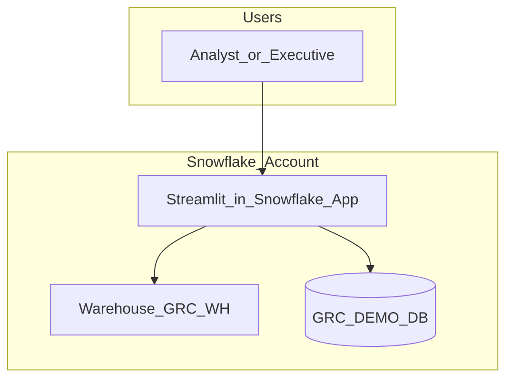
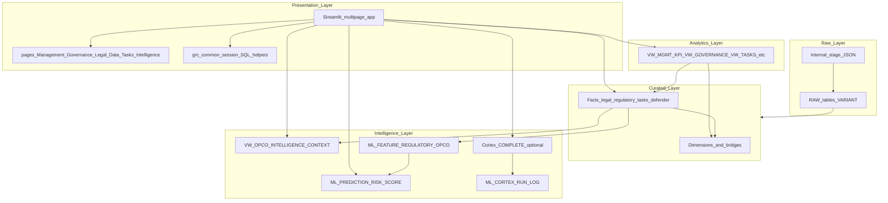

# End-to-end architecture: GRC on Snowflake (Streamlit UI)

This document describes the **target** deployment where the **React + Node** app is replaced by **Streamlit in Snowflake (SiS)**. Data, analytics, ML, and optional Cortex all run inside the Snowflake account.

---

## 1. System context

---

## 2. Layered architecture (logical)

---

## 3. Layer descriptions

### 3.1 Presentation (Streamlit)

| Element | Responsibility |
|---------|----------------|
| `app.py` | Landing page; warehouse/session implied by SiS runtime |
| `grc_common.py` | `get_active_session()`, `sql_to_pandas()`, sidebar **Parent / OpCo / period** |
| `pages/01–06` | One functional area each; **only** parameterized SQL using scoped UUIDs from session state |
| RBAC | Optional: `APP.STREAMLIT_ROLE_PAGE` + `CURRENT_ROLE()` to hide pages |

**Logic:** No business rules duplicated in Python beyond presentation (filters, layout). Aggregations stay in **views** or **tables** in Snowflake.

### 3.2 Analytics (`ANALYTICS` schema)

Stable **contracts** for the UI: joins and light aggregates so Streamlit stays thin.

| View | Used by page |
|------|----------------|
| `VW_MGMT_DASHBOARD_KPI` | Management, Home |
| `VW_DEPENDENCY_*` | Management |
| `VW_LEGAL_EXPIRY_UPCOMING` | Management |
| `VW_REGULATORY_CHANGES_SUMMARY` | Governance |
| `VW_DATA_SOVEREIGNTY_BY_OPCO` | Data & Defender |
| `VW_DEFENDER_POSTURE_BY_OPCO` | Data & Defender |
| `VW_TASK_QUEUE` | Tasks |
| `VW_OPCO_INTELLIGENCE_CONTEXT` | Intelligence |

### 3.3 Curated (`CURATED` schema)

System of record after ETL: dimensions, bridges, facts (POA, contracts, changes, tasks, Defender, etc.).

**Logic:** Single version of truth; row-level security can be applied here for multi-tenant demos.

### 3.4 Raw (`RAW` schema + stage)

Ingest **`server/data/*.json`** (or APIs) as `VARIANT`; **merge** into curated via SQL/Snowpark (Phase 2).

### 3.5 Intelligence / AI / ML (`ML` schema + Cortex)

| Object | Role |
|--------|------|
| `VW_OPCO_INTELLIGENCE_CONTEXT` | Assembles signals for humans and LLM |
| `ML_PREDICTION_RISK_SCORE` | Tabular risk output (model or rule-based) |
| `SNOWFLAKE.CORTEX.COMPLETE` | Natural language executive summary (optional) |
| `ML_CORTEX_RUN_LOG` | Audit trail for prompts/outputs |

**Logic:** Every Cortex invocation from Streamlit should **insert a row** into `ML_CORTEX_RUN_LOG` (implemented on page 06).

---

## 4. Data flow (happy path)

1. **Load:** JSON → stage → `RAW.*_RAW` → merge → `CURATED.*`
2. **Serve:** Streamlit `SELECT` from `ANALYTICS.VW_*` and selected `CURATED.FACT_*`
3. **Insight:** User opens Intelligence → read context view → optional Cortex → log → display history

---

## 5. Security notes

- Streamlit app **runs as its owner role**; that role must be least-privilege (see `scripts/07_streamlit_grants.sql`).
- Do not embed passwords in `.py` files; SiS uses Snowflake session identity.
- Parameterize SQL: this app only interpolates **UUIDs from dropdowns** (still validate in `grc_common.safe_uuid` if extending).

---

## 6. Relation to legacy React app

| Legacy | Snowflake replacement |
|--------|------------------------|
| React `MainNav` + views | Streamlit `app.py` + `pages/` |
| Express JSON files | `CURATED` + `RAW` |
| OpenAI in Node (some flows) | Cortex + `ML_CORTEX_RUN_LOG` |

Full view mapping: [VIEW_TO_UI_MAP.md](VIEW_TO_UI_MAP.md).

