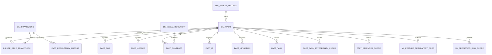

# Curated schema ERD (high level)

**Bridges (not all shown):** `BRIDGE_OPCO_LICENSING_AUTHORITY`, `BRIDGE_CHANGE_AFFECTED_OPCO`, `BRIDGE_OPCO_MULTI_SHAREHOLDER`.

**RAW layer:** One table per file with `payload VARIANT` — see [JSON_TO_TABLE_MAP.md](JSON_TO_TABLE_MAP.md).
