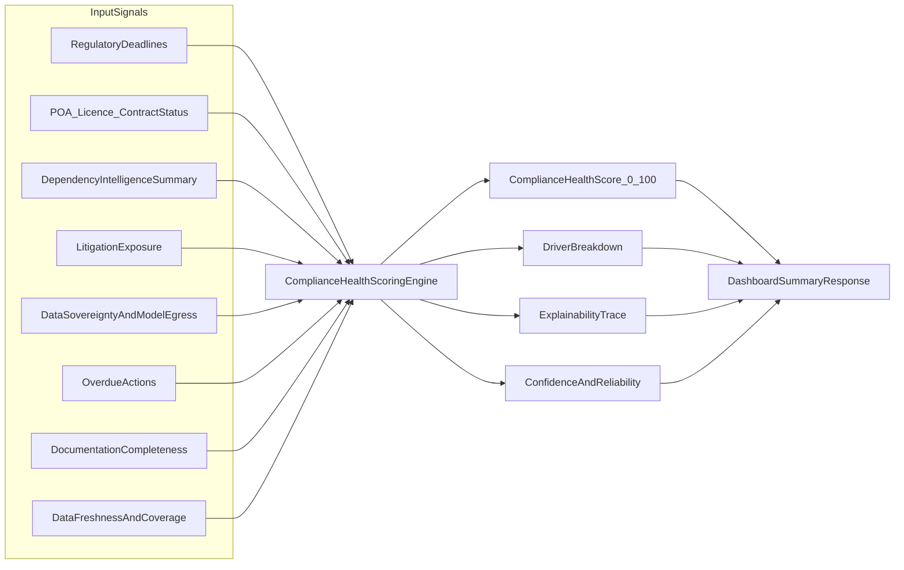

# Compliance Intelligence Sprint

## Objective
Transform Compliance Health into a data-and-facts driven score that is explainable, dynamic by context (OpCo/portfolio/time), and robust to sparse/noisy inputs while preserving the existing `complianceHealthScore` contract for current UI.

## Current Gaps (from review)
- Current score uses a simple 3-term formula and ignores major risk domains already available in payloads.
- Denominator coupling to recent changes can dilute or over-penalize outcomes.
- Expired legal artifacts and dependency-risk clusters are not first-class contributors.
- Dashboard currently shows only one number, so leadership lacks driver transparency.

## Architecture Strategy
1. Keep deterministic score engine as source-of-truth.
2. Add explainability trace and factor-level contributions.
3. Add reliability/freshness weighting so stale/incomplete data lowers confidence and influences score conservatively.
4. Keep `complianceHealthScore` numeric for backward compatibility; add detailed sibling object.

## Scope and Phases

### Phase 1 — Scoring Model Redesign (Deterministic)
- Define factor catalog with explicit ranges and penalties/rewards:
  - Regulatory pressure (critical/overdue weighted by impact window)
  - Legal expiry pressure (expiring and expired by artifact criticality)
  - Dependency intelligence pressure (cluster severity + unresolved count + exposure)
  - Data compliance pressure (cross-border model risk severity)
  - Litigation/commercial pressure (active high-risk + exposure buckets)
  - Documentation completeness pressure (critical missing evidence)
  - Action execution pressure (overdue/aging tasks)
  - Freshness/coverage modifier (confidence + conservative adjustment)
- Normalize each factor to 0-100 contribution and combine via configurable weights.
- Add guards for sparse datasets.

### Phase 2 — Service Extraction + API Contract
- Create dedicated service: `server/services/complianceHealthScoring.js`.
- Move scoring logic out of route and call from dashboard route.
- Extend response contract (non-breaking):
  - `complianceHealthScore` (existing number)
  - `complianceHealthDetail`:
    - `band`, `confidence`, `lastComputedAt`
    - `drivers[]` with `factor`, `weight`, `raw`, `normalized`, `impact`
    - `riskSignals` summary counts
    - `trace` + deterministic evidence pointers
- Define JSON schema for the detail object.

### Phase 3 — Intelligent/Adaptive Behaviour
- Add context-aware calibration:
  - Portfolio vs OpCo dynamic weighting
  - Sector/jurisdiction sensitivity multipliers using onboarding metadata
  - Threshold tuning by risk profile
- Add optional AI attribution (additive only):
  - Suggest weak/missing links for low-confidence areas
  - Never overwrite deterministic score/factors
  - Record AI confidence and reason in trace

### Phase 4 — Dashboard UX for Explainability
- Keep existing gauge unchanged.
- Add compact “Why this score” panel beneath Compliance Health tile:
  - Top negative drivers
  - Improving drivers
  - Confidence badge + freshness status
- Add drill-through to Dependency Intelligence.

### Phase 5 — Verification and Governance
- Deterministic test matrix:
  - Boundary tests (0 data, sparse data, high volume)
  - Monotonicity tests (risk increase cannot increase score)
  - Invariants (score always 0-100, reproducible for identical inputs)
- Contract tests for new response fields (backward compatibility).
- Regression tests for expired artifacts, overdue tasks, stale feed.
- Add scoring governance:
  - Factor definitions
  - Tuning policy
  - Review cadence
  - Versioned change control

## Delivery Sequence
1. Design/factor spec and weighting policy
2. Service extraction and API extension
3. UI explainability panel
4. Adaptive calibration and optional AI attribution
5. Full QA and calibration report

## Success Criteria
- Score materially changes with true risk changes across all major domains, not only deadlines.
- Every score is explainable via deterministic drivers and trace metadata.
- Existing dashboard remains functional with no breaking contract changes.
- Leadership can see both outcome and reason in one screen.
Evolve Compliance Health into an intelligent, evidence-based, explainable, and adaptive scoring system.

## Milestone
- [Compliance Intelligence Sprint](https://github.com/srinathkm/GRC-Product/milestone/2)

## Scope Breakdown
- CI-1: Deterministic factor model and weighting policy.
- CI-2: Scoring service extraction and backward-compatible API detail contract.
- CI-3: Adaptive calibration by entity context and reliability.
- CI-4: Dashboard explainability UX and drill-through.
- CI-5: Hybrid AI attribution with deterministic precedence.
- CI-6: QA audit and release gate.

## Associated Tickets
- [CI-1: Deterministic Compliance Health Factor Model and Weighting](https://github.com/srinathkm/GRC-Product/issues/19)
- [CI-2: Compliance Health Scoring Service + Backward-Compatible API Contract](https://github.com/srinathkm/GRC-Product/issues/20)
- [CI-3: Adaptive Calibration by Entity Context and Data Reliability](https://github.com/srinathkm/GRC-Product/issues/21)
- [CI-4: Dashboard Explainability UX (Drivers, Confidence, Drill-through)](https://github.com/srinathkm/GRC-Product/issues/22)
- [CI-5: Hybrid AI Attribution (Additive Only) with Deterministic Precedence](https://github.com/srinathkm/GRC-Product/issues/23)
- [CI-6: End-to-End QA Audit, Business Validation, and Release Gate](https://github.com/srinathkm/GRC-Product/issues/24)

## Gate Rule
No implementation merge without completion of exhaustive functional, business, and technical test plans defined in each ticket.
