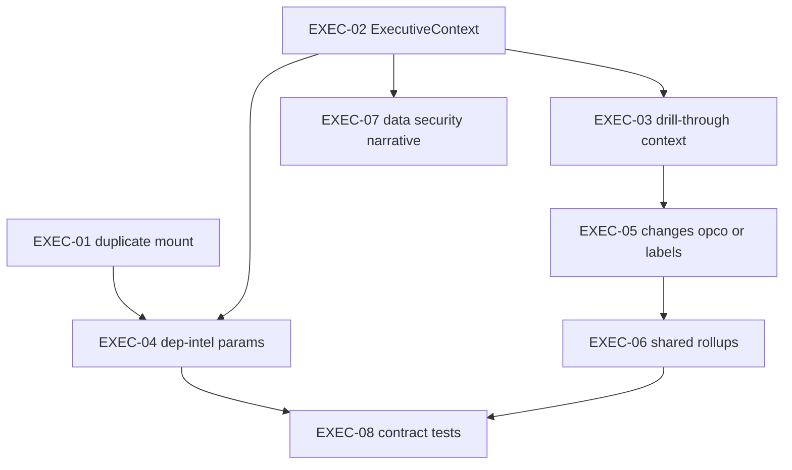

# Dashboard–Module Consistency Sprint

**Sprint theme:** Align Management Dashboard aggregates with drill-down modules so a C-level reviewer sees the same **scope** (portfolio / parent / OpCo), **time window**, **definitions** (e.g. critical regulatory change), and **data provenance** (live vs mock vs AI) when moving from the executive summary into each module.

**Source plan:** Derived from the architecture audit in `.cursor/plans/dashboard-module_consistency_audit_5199a9c0.plan.md` (repo-relative reference for local Cursor plans).

**Repository:** https://github.com/srinathkm/GRC-Product

---

## Objective

Eliminate silent divergence between:

- [`client/src/components/ManagementDashboard.jsx`](client/src/components/ManagementDashboard.jsx) (local `days` / `selectedOpco` + `GET /api/dashboard/summary`)
- Drill-down modules (Dependency Intelligence, Governance Framework / changes APIs, legal registers, Data Security, Task Tracker)

so executive narrative and numbers stay **auditable** end-to-end.

---

## Success criteria (release gate)

- A single visible **executive context** (at least: period + OpCo when selected + data freshness) is consistent across Management Dashboard and linked modules after navigation.
- Dependency Intelligence **summary matches** dashboard embedded dependency summary when `includeAi=false` and query params (`days`, `opco`) are identical.
- Mock or demo data is **explicitly labeled**; no implication that Defender-style mocks are the same as `dataComplianceDetail` from `dataComplianceIntelligence.js`.
- Regulatory counts either **match** under the same filters or the UI explains **why** they differ (scope legend).
- No duplicate React trees for the same view (Dependency Intelligence).

---

## Ticket index (GitHub)

| ID | Issue | Title | Priority |
|----|--------|--------|----------|
| EXEC-01 | [#31](https://github.com/srinathkm/GRC-Product/issues/31) | Fix duplicate DependencyIntelligence mount in App | P0 |
| EXEC-02 | [#32](https://github.com/srinathkm/GRC-Product/issues/32) | Introduce shared ExecutiveContext in App shell | P0 |
| EXEC-03 | [#33](https://github.com/srinathkm/GRC-Product/issues/33) | Management Dashboard drill-through passes full context | P0 |
| EXEC-04 | [#34](https://github.com/srinathkm/GRC-Product/issues/34) | Dependency Intelligence: align API query params with dashboard | P1 |
| EXEC-05 | [#35](https://github.com/srinathkm/GRC-Product/issues/35) | Changes API: OpCo filter or explicit scope labeling vs dashboard | P1 |
| EXEC-06 | [#36](https://github.com/srinathkm/GRC-Product/issues/36) | Extract shared regulatory rollup helpers (dashboard + changes) | P2 |
| EXEC-07 | [#37](https://github.com/srinathkm/GRC-Product/issues/37) | Data Security: align or separate narratives; provenance labels | P1 |
| EXEC-08 | [#38](https://github.com/srinathkm/GRC-Product/issues/38) | Contract tests: dashboard vs dependency-intelligence parity | P2 |

**Creating issues in GitHub**

1. **GitHub CLI** (if installed): for each issue in [Appendix: GitHub issue bodies](#appendix-github-issue-bodies-copy-paste), run  
   `gh issue create --repo srinathkm/GRC-Product --title "..." --body-file -` and paste the body, or use `--label` for suggested labels (`enhancement`, `bug`, `tech-debt`, `dashboard`, `testing`).
2. **GitHub web UI:** New issue → paste **Title** and **Body** from the appendix.
3. **Automation:** Canonical payload is [`sprints/dashboard-consistency-issues.manifest.json`](dashboard-consistency-issues.manifest.json). Run from repo root:  
   `GITHUB_TOKEN=... node scripts/create-dashboard-consistency-issues.mjs`  
   Requires a token with **Issues** write access to `srinathkm/GRC-Product`. If labels are missing in the repo, GitHub may reject the request; create labels first or trim `labels` in the manifest.

After creation, add issue numbers to the ticket table above (e.g. `#42`) or link them in a GitHub Project.

---

## Execution plan (by phase)

### Phase A — Quick wins (week 1)

1. **EXEC-01** — Remove the duplicate `currentView === 'dependency-intelligence'` block in [`client/src/App.jsx`](client/src/App.jsx). Keep a single `<DependencyIntelligence onNavigateToView={navigateWithContext} />`. Verify one network fan-out per load in DevTools.

2. **EXEC-02** — Lift `days` and `selectedOpco` used for executive views into `App` (or a thin `ExecutiveContext` provider colocated in `App.jsx`). [`ManagementDashboard`](client/src/components/ManagementDashboard.jsx) becomes controlled: receives `days`, `selectedOpco`, `onDaysChange`, `onOpcoChange` (and optionally `selectedParentHolding` / resolver callbacks). Deprecate duplicate local state that only served `/dashboard/summary`.

3. **EXEC-03** — Audit every `onNavigate(...)` in Management Dashboard: pass `{ selectedOpco, selectedParentHolding?, selectedDays }` where applicable. Special cases:
   - Data compliance pane “Open module” → include OpCo (and resolve parent via `/api/companies/by-opco` if needed before navigation).
   - Task Tracker → pass filter context if the API supports it in a later ticket; minimum pass OpCo for UI pre-filter or banner.

**Exit criteria:** Navigating from Management Dashboard never silently drops OpCo/period when the user had narrowed the view.

### Phase B — API and module alignment (week 2)

4. **EXEC-04** — Update [`client/src/components/DependencyIntelligence.jsx`](client/src/components/DependencyIntelligence.jsx) to append `days`, `opco`, and `includeAi` from ExecutiveContext to `/api/dependency-intelligence/summary` and `/clusters` (and detail fetch). Default `includeAi` should match dashboard (`false`) unless user toggles AI in the module (then label “AI-enriched” vs dashboard).

5. **EXEC-05** — Either:
   - **Option A:** Add optional `opco` query param to [`server/routes/changes.js`](server/routes/changes.js) for `GET /` and `GET /summary`, filtering changes whose `affectedCompanies` includes the OpCo (mirror logic in [`server/routes/dashboard.js`](server/routes/dashboard.js)), or
   - **Option B:** Add explicit UI copy on Governance Framework and Management Dashboard when comparing totals (“Portfolio-wide governance view” vs “OpCo-scoped executive view”).

6. **Sync period on navigation:** When opening `governance-framework` from Management Dashboard, set App `selectedDays` from the same executive period (or remove duplicate period selectors from Management Dashboard once context is unified).

**Exit criteria:** Dependency module numbers reproducibly match dashboard; regulatory story is either aligned or honestly scoped.

### Phase C — Single source of truth (server) (week 3)

7. **EXEC-06** — Extract pure helpers (e.g. `normalizeDemoDates`, `filterChangesByPeriod`, `filterChangesByOpco`, `countCriticalOverdue`) into `server/services/regulatoryMetrics.js` (name as appropriate). Call from both [`dashboard.js`](server/routes/dashboard.js) and [`changes.js`](server/routes/changes.js). Add unit tests for edge cases: empty file, missing deadline, invalid dates.

8. **Optional follow-up:** Thin `GET /api/metrics/regulatory?days=&opco=` used by dashboard and governance clients to reduce duplication further (only if EXEC-05/06 still leave drift risk).

**Exit criteria:** One implementation path for “recent / critical / overdue” regulatory definitions.

### Phase D — Data Security narrative (week 3–4)

9. **EXEC-07** — Product decision recorded in ticket:
   - **Integrate:** Surface `dataComplianceDetail` (from summary or dedicated read-only endpoint) inside [`DataSecurityCompliance.jsx`](client/src/components/DataSecurityCompliance.jsx) for the “evidence-based” strip, **or**
   - **Separate:** Rename nav / tabs so “Security posture (demo)” vs “Data compliance intelligence” cannot be conflated.

   Add provenance banners: deterministic JSON sources vs mock `OPCO_*_MOCK` blocks vs Defender API.

**Exit criteria:** CISO/CDO cannot mistake mock scores for production aggregates.

### Phase E — Verification (ongoing + week 4)

10. **EXEC-08** — Add Node tests that call `GET /api/dashboard/summary` and `GET /api/dependency-intelligence/summary` with identical `days`, `opco`, and assert key fields on `dependencyIntelligence` / summary match (or document allowed deltas). Extend with snapshot/golden files if stable.

11. **Smoke / E2E (manual or Playwright later):** Select OpCo + 180 days on Management Dashboard → open Dependency Intelligence → assert URL/state and top-line totals match; repeat for governance if OpCo filter implemented.

**Exit criteria:** CI fails if dashboard and dependency API diverge under the same query contract.

---

## Risk register

| Risk | Mitigation |
|------|------------|
| Breaking existing demos that rely on portfolio-wide governance | Feature-flag OpCo filter or default empty = all |
| Large refactor of App props | Introduce context provider to avoid prop drilling explosion |
| Mock removal breaks UX | Keep mocks behind `VITE_DEMO_MODE` or explicit “Illustrative” section |

---

## Dependencies between tickets



---

## Appendix: GitHub issue bodies (copy-paste)

Suggested labels per issue are noted; create labels in the repo if they do not exist.

### EXEC-01 — P0 — labels: `bug`, `dashboard`

**Title:** `[EXEC-01] Fix duplicate DependencyIntelligence mount in App.jsx`

**Body:**

```markdown
## Summary
`App.jsx` renders `<DependencyIntelligence />` twice when `currentView === 'dependency-intelligence'` (different `onNavigateToView` props). This duplicates network calls and is confusing for debugging.

## Scope
- File: `client/src/App.jsx`
- Keep **one** mount; use `navigateWithContext` consistently.

## Acceptance criteria
- [ ] Only one `DependencyIntelligence` component in the tree for that view
- [ ] Back navigation uses context-aware navigation where applicable
- [ ] Manual check: Network tab shows single parallel batch to `/api/dependency-intelligence/summary` and `/clusters` on load

## Sprint
Dashboard–Module Consistency — Phase A (`sprints/Dashboard-Module-Consistency-Sprint.md`)
```

### EXEC-02 — P0 — labels: `enhancement`, `dashboard`

**Title:** `[EXEC-02] Introduce shared ExecutiveContext (days, opco, parent, flags)`

**Body:**

```markdown
## Problem
Management Dashboard keeps **local** `days` and `selectedOpco` while `App` owns `selectedDays`, `selectedOpco`, and `selectedParentHolding`. Executive drill-down loses scope.

## Proposed approach
- Add React context (or lift state in `App.jsx`) for: `executiveDays`, `executiveOpco`, optional `executiveParent`, `includeAiDependency` (default false to match dashboard).
- Pass controlled props into `ManagementDashboard` OR consume context inside it.

## Acceptance criteria
- [ ] Single source of truth for period + OpCo used by Management Dashboard
- [ ] `navigateWithContext` continues to work; no regression for org/parent flows
- [ ] Document context fields in a short comment block or README snippet

## Sprint
Dashboard–Module Consistency — Phase A/B

## Related
`client/src/App.jsx`, `client/src/components/ManagementDashboard.jsx`
```

### EXEC-03 — P0 — labels: `enhancement`, `dashboard`

**Title:** `[EXEC-03] Management Dashboard: pass full context on all drill-throughs`

**Body:**

```markdown
## Problem
Several `onNavigate` calls omit `selectedOpco` / period / parent, e.g. data compliance “Open module” → `data-security`, remediation → `task-tracker`, shortcuts to governance / org dashboard.

## Scope
- File: `client/src/components/ManagementDashboard.jsx`
- Resolve parent via existing `/api/companies/by-opco` when needed before navigation (pattern already in `App.jsx`).

## Acceptance criteria
- [ ] Every intentional drill-through passes `selectedOpco` when user had filtered by OpCo
- [ ] Governance / org navigations sync period from executive context (see sprint Phase B)
- [ ] QA checklist in PR description

## Sprint
Dashboard–Module Consistency — Phase A

## Depends on
EXEC-02 (preferred) or minimal prop drilling from App
```

### EXEC-04 — P1 — labels: `enhancement`, `dashboard`

**Title:** `[EXEC-04] Dependency Intelligence: pass days, opco, includeAi to API`

**Body:**

```markdown
## Problem
`/api/dashboard/summary` calls `computeDependencyIntelligence({ days, selectedOpco, includeAi: false })` but `DependencyIntelligence.jsx` calls REST endpoints **without** `days`/`opco`, so totals diverge from Management Dashboard.

## Scope
- `client/src/components/DependencyIntelligence.jsx`
- Append query params: `days`, `opco`, `includeAi` aligned with executive context.

## Acceptance criteria
- [ ] With same `days`, `opco`, `includeAi=false`, summary matches dashboard embedded `dependencyIntelligence`
- [ ] When user enables AI in module, UI states enrichment may differ from dashboard card

## Sprint
Dashboard–Module Consistency — Phase B

## Depends on
EXEC-02
```

### EXEC-05 — P1 — labels: `enhancement`, `dashboard`

**Title:** `[EXEC-05] Changes API: optional OpCo filter OR explicit scope labeling vs dashboard`

**Body:**

```markdown
## Problem
Management Dashboard filters regulatory changes by OpCo when `opco` is set; `/api/changes` and `/api/changes/summary` are portfolio-wide. Execs comparing numbers see different universes.

## Options
- **A:** Add optional `opco` to `GET /api/changes` and `GET /api/changes/summary` (filter `affectedCompanies`).
- **B:** Add prominent UI labels: portfolio vs OpCo-scoped metrics.

## Acceptance criteria
- [ ] Decision recorded in PR (A or B or hybrid)
- [ ] If A: contract documented; Governance `Dashboard.jsx` passes `opco` when in executive mode
- [ ] If B: copy reviewed for C-level clarity

## Sprint
Dashboard–Module Consistency — Phase B

## Related
`server/routes/changes.js`, `server/routes/dashboard.js`, `client/src/components/Dashboard.jsx`
```

### EXEC-06 — P2 — labels: `tech-debt`, `dashboard`

**Title:** `[EXEC-06] Extract shared regulatory rollup helpers for dashboard + changes routes`

**Body:**

```markdown
## Problem
`normalizeDates` / `normalizeDatesForDemo` and critical/overdue logic exist in parallel in `dashboard.js` and `changes.js`, increasing drift risk.

## Approach
- New module e.g. `server/services/regulatoryMetrics.js` with pure functions + tests.
- Refactor both routes to call shared helpers.

## Acceptance criteria
- [ ] Unit tests cover empty data, missing deadlines, date shift behaviour
- [ ] No behaviour change for default portfolio requests (regression tests / snapshot)

## Sprint
Dashboard–Module Consistency — Phase C

## Depends on
EXEC-05 if OpCo filtering changes inputs
```

### EXEC-07 — P1 — labels: `enhancement`, `dashboard`

**Title:** `[EXEC-07] Data Security: align mock vs dataComplianceDetail + provenance labels`

**Body:**

```markdown
## Problem
`DataSecurityCompliance.jsx` uses large in-file mocks and parent-scoped Defender APIs; Management Dashboard exposes `dataComplianceDetail` from `dataComplianceIntelligence.js`. Different semantics and scores.

## Approach (pick in PR)
- Integrate evidence-based strip from API, **or** split IA (separate labels: demo vs production signals).
- Add provenance banners.

## Acceptance criteria
- [ ] No silent equivalence between mock scores and deterministic compliance score
- [ ] Product copy approved for exec-facing honesty

## Sprint
Dashboard–Module Consistency — Phase D

## Related
`client/src/components/DataSecurityCompliance.jsx`, `server/services/dataComplianceIntelligence.js`
```

### EXEC-08 — P2 — labels: `tech-debt`, `testing`

**Title:** `[EXEC-08] Contract tests: dashboard summary vs dependency-intelligence summary`

**Body:**

```markdown
## Goal
Prevent regression: under identical `days`, `opco`, `includeAi=false`, embedded dependency summary matches `/api/dependency-intelligence/summary`.

## Scope
- Node test under `server/tests/` (spin router or call handlers if needed, or HTTP against test server)
- Document any intentional allowed deltas

## Acceptance criteria
- [ ] CI runs new test
- [ ] Fails on known key field mismatch (define list in test: e.g. totalClusters, totalExposureAed — align with actual schema)

## Sprint
Dashboard–Module Consistency — Phase E

## Depends on
EXEC-04
```

---

## Appendix: Automation files in repo

- [`dashboard-consistency-issues.manifest.json`](dashboard-consistency-issues.manifest.json) — all eight issues as JSON for the GitHub REST API.
- [`scripts/create-dashboard-consistency-issues.mjs`](../scripts/create-dashboard-consistency-issues.mjs) — posts each issue; run with `GITHUB_TOKEN` set.

---

## References

- [`server/routes/dashboard.js`](server/routes/dashboard.js) — `/api/dashboard/summary`
- [`server/routes/dependencyIntelligence.js`](server/routes/dependencyIntelligence.js)
- [`server/routes/changes.js`](server/routes/changes.js)
- [`server/services/dataComplianceIntelligence.js`](server/services/dataComplianceIntelligence.js)
- [`client/src/App.jsx`](client/src/App.jsx)
