# Data Compliance Value-Driven Transformation Plan (CISO/CDO View)

## North Star

Deliver a single executive pane that answers, at any point in time:

- Are we compliant by jurisdiction and framework for data residency, transfer, and security controls?
- Where is the current business exposure (financial, regulatory, operational), and what changed?
- Who owns each gap, what is due next, and what is the forecasted impact if unresolved?

## Current-State Findings (from code review)

- Data signals are fragmented across views: sovereignty in `client/src/components/DataSovereignty.jsx`, security posture in `client/src/components/DataSecurityCompliance.jsx`, and AI cross-border insights in `server/routes/dashboard.js`.
- Executive health score does not include data compliance risk drivers in a first-class way.
- Sovereignty status in UI depends on mock status maps and fallback defaults, reducing trust for audit/regulator use.
- AI cross-border insights can be generated from default model catalog behavior when model inventory data is missing, which is not an attested enterprise source.
- Ownership/remediation workflow is weak in sovereignty view (owner, SLA, due date, evidence lifecycle, exception expiry).

## CISO/CDO Outcome Model (what value means)

- **Regulatory confidence:** demonstrable, evidence-backed posture per jurisdiction/framework.
- **Risk reduction:** measurable drop in unresolved critical data-transfer/security exposures.
- **Time-to-action:** reduced time from detection to assigned remediation and closure.
- **Decision quality:** explicit confidence/provenance for every executive metric.
- **Board readiness:** clear impact narrative (fines, operational disruption, strategic programs affected).

## Target Operating Design

### 1) Unified Data Compliance Command Pane

Create a consolidated executive view that combines sovereignty + security + AI transfer risk:

- Posture summary: compliance score, confidence, trend, critical exposures.
- Exposure map: jurisdiction x OpCo x framework x data category x model flow.
- Action panel: top risks with owner, due date, SLA, and likely business impact.
- Provenance panel: data source, last validation time, evidence count, confidence band.

Primary touchpoints:

- `client/src/components/DataSovereignty.jsx`
- `client/src/components/DataSecurityCompliance.jsx`
- `client/src/components/ManagementDashboard.jsx`

### 2) Evidence-Backed Data Contracts (remove ambiguity)

Introduce a canonical backend contract for data compliance posture that is source-labeled and confidence-scored.

- New aggregate contract from backend: `dataComplianceDetail` with:
  - `overallScore`, `confidence`, `trend`, `lastComputedAt`
  - `riskDrivers[]` (jurisdiction, control family, severity, impact, deterministic evidence refs)
  - `aiTransferRisks[]` (model/app/hosting region/transfer basis/mitigation status)
  - `remediationQueue[]` (owner, due, SLA, status, blockers)
  - `sourceCoverage` (systems contributing and missing)
- Keep backward compatibility for existing summary payload fields.

Primary touchpoints:

- `server/routes/dashboard.js`
- `server/services/dependencyIntelligence.js`
- `server/routes/dataSovereignty.js`

### 3) CISO/CDO Risk and Impact Framework

Standardize scoring and impact linkage:

- Risk factors: residency violations, unapproved cross-border flows, missing encryption/key controls, unmitigated critical findings, stale attestations.
- Business impact mapping per risk: regulatory penalty risk, customer trust risk, contract/revenue risk, operational continuity risk.
- Confidence mechanics: data freshness, source reliability, and coverage completeness.
- Deterministic precedence; AI is advisory only and cannot overwrite deterministic conclusions.

### 4) Governance and Accountability Layer

Add operating controls expected by CISO/CDO:

- RACI per control family (owner, accountable executive).
- Exception workflow with expiry and compensating controls.
- Escalation policy for overdue critical findings.
- Audit-grade event trail for control status changes.

## Proposed Architecture (high-level)

```mermaid
flowchart LR
  subgraph sourceLayer [SourceLayer]
    sovereigntyChecks[DataSovereigntyChecks]
    defenderSignals[DefenderPostureSignals]
    modelInventory[AIModelInventory]
    onboardingData[OnboardingOpcoData]
    obligations[FrameworkObligations]
    remediationData[ActionTrackerData]
  end

  sourceLayer --> normalizer[ComplianceSignalNormalizer]
  normalizer --> scorer[DataComplianceScoringEngine]
  normalizer --> provenance[ProvenanceAndCoverageEngine]
  scorer --> impactMapper[BusinessImpactMapper]
  provenance --> impactMapper
  impactMapper --> apiLayer[DashboardSummaryAndDataComplianceDetailAPI]
  apiLayer --> cisoPane[CISO_CDO_CommandPane]
  apiLayer --> execDash[ManagementDashboard]
```

## Delivery Roadmap (phased)

### Phase A — Foundation and Contracts

- Define canonical data contract and schema for `dataComplianceDetail`.
- Define severity taxonomy harmonization (Critical/High/Medium/Low) across all sources.
- Add source provenance and coverage indicators to each insight.
- Add ADR for deterministic-vs-AI merge policy specific to Data Compliance.

### Phase B — Data Integrity and Coverage Hardening

- Replace mock-dependent sovereignty status path with API-backed attestation model.
- Replace default model-catalog fallback with explicit `unknown/unconfigured` status.
- Implement ingestion validation: missing inventory, stale attestations, conflicting jurisdiction tags.
- Add freshness SLAs and stale-data flags surfaced in UI.

### Phase C — Executive UX and Decision Support

- Build unified command-pane UX with:
  - score + confidence + trend
  - top exposure heatmap
  - actionable remediation queue
  - impact narrative cards (financial/regulatory/operational)
- Add drill-down path from Management Dashboard to Data Compliance detail with filters pre-applied.
- Add bilingual support coverage for key executive copy blocks.

### Phase D — Operationalization and Governance

- Add policy-based escalations for critical overdue items.
- Add monthly posture pack export for board/risk committee.
- Add role-sensitive views (CISO, CDO, Board, OpCo owner).
- Implement audit trail reporting and control attestations snapshotting.

### Phase E — Assurance and Release Gate

- Functional, business, and technical verification complete.
- Security/privacy review complete (PII handling, transfer-logging boundaries, authz checks).
- Data quality gate: minimum coverage threshold before showing executive score as trusted.
- Release gate with rollback criteria and runbook.

## Work Items and FR Mapping

- FR-DC-1: Canonical `dataComplianceDetail` contract and evidence provenance foundation.
- FR-DC-2: Data integrity hardening and elimination of mock/default executive signals.
- FR-DC-3: CISO/CDO scoring model linking technical risk to business impact.
- FR-DC-4: Unified CISO/CDO command pane UX and management dashboard drill-through.
- FR-DC-5: Governance controls (RACI, exceptions, escalations, immutable audit trail).
- FR-DC-6: End-to-end assurance gate and release readiness.

## Mandatory Test-First Implementation Gate

No build/wiring work starts until the following are complete and passing for the relevant FR:

- Contract tests for APIs and schema validation.
- Functional tests for expected behavior and edge cases.
- Business scenario tests for CISO/CDO and board use-cases.
- Technical resilience tests (timeouts, partial data, stale data).
- Security/control tests (authz, PII minimization, immutable audit logging).

Each FR must include these checklists as acceptance gates:

- [ ] Test plan approved by product + security owner.
- [ ] Automated tests implemented for all declared scenarios.
- [ ] All tests green in CI for two consecutive runs.
- [ ] Coverage and quality thresholds met.
- [ ] Only then implementation/wiring is permitted to begin.

## Exhaustive Validation Plan

### Functional

- Correctness of consolidated score and drivers under normal, sparse, and conflicting inputs.
- Drill-down integrity: every top risk links to evidence and owner.
- Filter behavior consistency (jurisdiction, framework, OpCo, severity, status).

### Business

- CISO scenario: identify top 3 critical data exposures and assign remediation in under 10 minutes.
- CDO scenario: validate residency posture for top revenue OpCos and assess transfer risk trend.
- Board scenario: consume one-page risk/impact narrative with confidence and open criticals.

### Technical

- Contract tests for all response objects (backward compatibility + new detail schema).
- Determinism tests for score given identical inputs.
- Freshness/coverage confidence tests and stale-data behavior.
- Performance budgets for summary/detail APIs under expected portfolio size.
- Resilience tests with partial source outages and timeout behavior.

### Security and Control

- Authorization checks by role and scope.
- Input validation and schema enforcement at all API boundaries.
- Prompt safety and PII minimization where AI enrichment is used.
- Immutable audit logging for state transitions and exceptions.

## KPIs CISO/CDO should track from this pane

- Critical data compliance exposures (open/overdue trend).
- Evidence completeness ratio by jurisdiction/framework.
- Cross-border AI transfer risk count by legal basis status.
- Mean time to remediate critical data findings.
- Confidence index of executive score (coverage x freshness x source trust).
- OpCo compliance variance and concentration risk.

## Key Risks and Mitigations

- **Risk:** Incomplete model inventory leads to false confidence.  
  **Mitigation:** Explicit unknown-state classification; confidence penalty; onboarding guardrails.
- **Risk:** Mixed severity taxonomy across modules.  
  **Mitigation:** Centralized severity dictionary and mapping tests.
- **Risk:** Executive dashboard over-simplifies nuanced legal requirements.  
  **Mitigation:** Always link score to jurisdiction-specific evidence and obligation references.

## Implementation Priority Order

1. Contract and scoring foundation (Phase A)
2. Data integrity hardening (Phase B)
3. Executive pane UX (Phase C)
4. Governance/operating controls (Phase D)
5. Final assurance and go-live gate (Phase E)

## Definition of Done (CISO/CDO acceptance)

- Executive can view trusted current posture with explicit confidence and provenance.
- Every critical exposure has owner, due date, and business-impact context.
- Data transfer and sovereignty risks are integrated into top-level compliance decisioning.
- Audit and regulator-facing evidence is exportable and traceable without manual reconciliation.

## FR Issue Links

- FR-DC-1: https://github.com/srinathkm/GRC-Product/issues/25
- FR-DC-2: https://github.com/srinathkm/GRC-Product/issues/26
- FR-DC-3: https://github.com/srinathkm/GRC-Product/issues/27
- FR-DC-4: https://github.com/srinathkm/GRC-Product/issues/28
- FR-DC-5: https://github.com/srinathkm/GRC-Product/issues/29
- FR-DC-6: https://github.com/srinathkm/GRC-Product/issues/30
