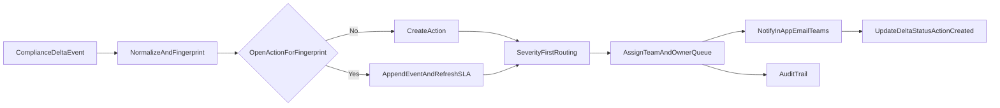

# Workflow and Routing Design

## End-to-End Flow

## Canonical Delta Event
- `deltaId`, `sourceType`, `detectedAt`, `module`, `framework`, `severity`
- `opco`, `parent`, `beforeValue`, `afterValue`, `deltaSummary`
- `deltaFingerprint` (deterministic hash)

## Internal Workflow States
- `detected`
- `action_created`
- `assigned`
- `in_progress`
- `resolved`
- `closed`

Allowed transitions are explicit and audited. Invalid transitions are rejected with explanatory errors.

## Routing Policy
- Critical: route to central risk response team first.
- High/Medium/Low: route to mapped module team.
- If mapping missing: send to fallback triage queue.

## SLA Policy
- Critical: +1 day
- High: +2 days
- Medium: +5 days
- Low: +10 days

`slaDueAt` is set at action creation and recalculated on severity increase events.

## Idempotency and Deduplication
- Fingerprint formula includes normalized source, module, framework, entity scope, and delta payload.
- If same fingerprint exists with open action:
  - append timeline event
  - keep one primary action
  - refresh `updatedAt` and evaluate SLA/escalation.

## Failure Handling
- Action creation must not fail due to notification errors.
- Notification fanout is asynchronous with retry metadata.
- Every failed channel attempt is logged to audit trail for operator retries.
