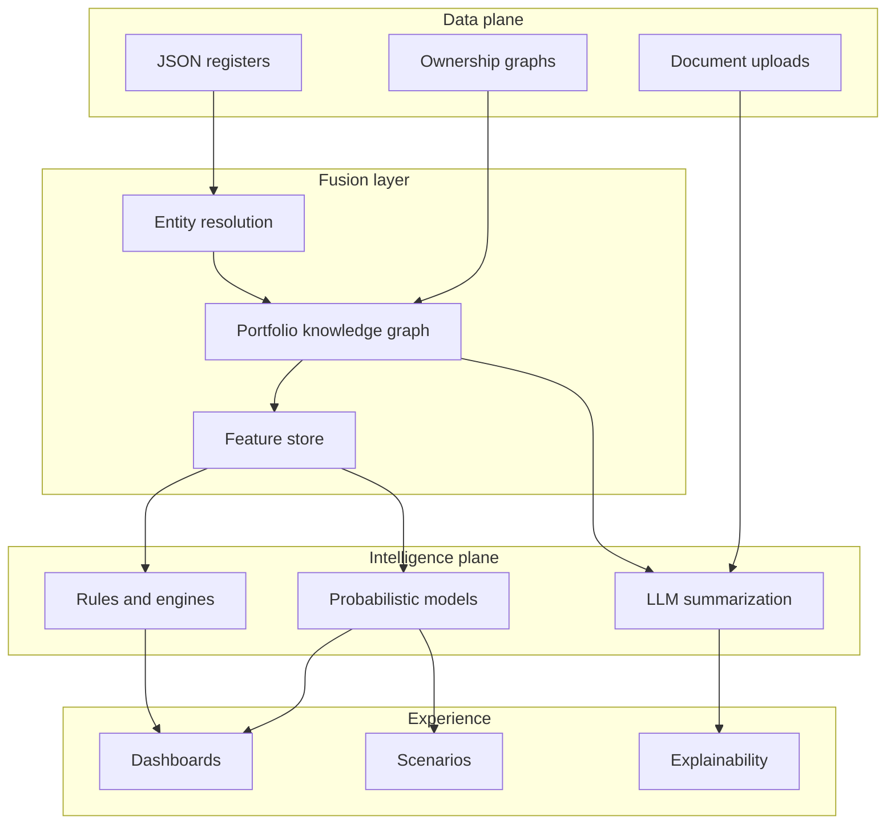
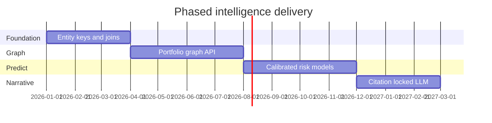
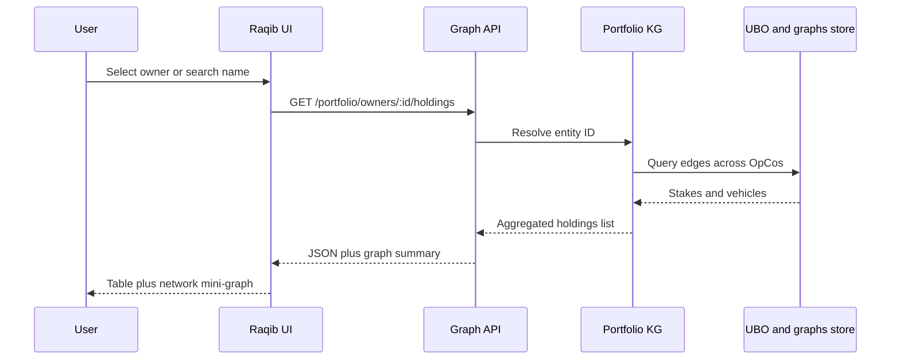
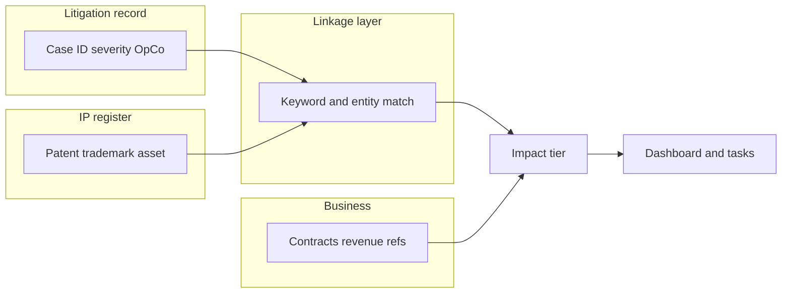

# AI Intelligence & Portfolio Graph Vision

**Audience:** Architects, product, sales engineering, prospects  
**Product:** Raqib (Regulation Changes Dashboard)  
**Status:** Vision / roadmap (not committed implementation scope)

This document describes how the platform can become more **intelligent** using **existing registers and APIs**: predictions, **ownership network** reasoning (where an owner appears elsewhere), and **cross-module legal impact** (e.g. litigation touching IP and business exposure). It also positions **Obsidian-style** ideas (graph thinking) vs **embedding Obsidian** as a product.

---

## 1. Executive framing

**Problem:** Legal, governance, and entity data live in **strong modules** (UBO, IP, litigations, contracts, regulatory changes) but **cross-domain questions** are hard: *“Where else does this beneficial owner appear?”*, *“Which IP assets are implicated if this case escalates?”*, *“What is the likely compliance trajectory next quarter?”*

**North star:** A **portfolio intelligence layer** on top of the same JSON/API data: a **unified entity view**, **explainable scores**, and **impact narratives** with citations—not a black box.

**Principles:**

- **Evidence-first:** Every score and summary must point to underlying rows (change id, contract id, graph edge).
- **Human in the loop** for merges of persons/entities and for high-impact classifications.
- **Phase** delivery: deterministic joins before ML; ML before unconstrained LLM on decisions.

---

## 2. Architecture layers

High-level data and intelligence flow:

**Legend:** *Fusion* builds a **single graph of entities and relationships** from UBO rows, ownership graphs, and OpCo keys. *Intelligence* combines rules (deadlines, thresholds), optional ML (calibrated risk), and LLM for **language** and **extraction**, under guardrails.

---

## 3. Use-case catalog

Each item: **Who** | **Trigger** | **Data** | **Intelligence** | **UI concept**

### A. Predictive and foresight

| Use case | Description |
|----------|-------------|
| **Deadline trajectory** | Per OpCo, estimate risk of **missed regulatory / POA / licence** deadlines using history + current backlog (rules or survival-style scoring). |
| **Regulatory scenario** | “If **framework X** adds obligation **Y**, which OpCos and **contracts** are in scope first?” (dependency intelligence extended with template obligations). |
| **Exposure ranges** | Combine **litigation** financial fields with **contract** penalty / indemnity metadata for **range** estimates (not statutory accounting). |
| **Posture drift** | Trend **Defender** / data-sovereignty signals over time when snapshots exist. |

### B. Ownership and UBO intelligence

| Use case | Description |
|----------|-------------|
| **Entity resolution** | Match “same person / same corporate” across UBO tables, ownership graph nodes, and registry strings (fuzzy match + analyst confirm). |
| **Cross-holdings (“where else?”)** | Given a resolved **owner**, list **all other stakes** in the portfolio (other OpCos, intermediate vehicles). *Illustrated in mockup below.* |
| **Control vs economic** | Flag divergence between nominal %, voting, board rights, nominee structures (rules + document-assisted extraction). |
| **Concentration** | Portfolio-level **HHI** / top-N owners; overlap between **litigation parties** and **ownership** edges for conflict / related-party review. |

### C. Legal module cross-impact

| Use case | Description |
|----------|-------------|
| **IP–litigation linkage** | Link cases to **IP assets** by OpCo, jurisdiction, subject keywords, product line. *Illustrated in mockup below.* |
| **Business impact** | Map IP to **revenue-critical** contracts or product metadata → **tiered impact** when case status changes. |
| **Contractual knock-on** | Surface contracts that **reference** affected IP or indemnities when litigation opens or settles. |
| **Remediation tasks** | Suggest **tasks** when litigation severity crosses threshold or IP renewal collides with open matter. |

### D. Governance and narrative

| Use case | Description |
|----------|-------------|
| **Root-cause chain** | Dependency intelligence as a **chain**: change → obligation → contract → owner → board action. |
| **Board narrative** | LLM-generated **paragraph** with **mandatory citations** to JSON rows only. |
| **M&A alignment** | Ownership graph **deltas** feeding M&A simulator storylines (synergy vs risk). |

### E. Trust and compliance

- **Explainability** panels for every score.
- **Audit log** of model version, data snapshot, and prompt hash for sensitive summaries.
- **No unconstrained LLM** on binding legal conclusions without human sign-off.

---

## 4. Phased delivery

| Phase | Focus | Outcome |
|-------|--------|---------|
| **P0** | Stable **entity and join keys** across `litigations`, `ip`, `contracts`, `opco` | Deterministic links, no ML |
| **P1** | **Materialized portfolio graph** + **cross-holdings** query API | “Where else does owner X appear?” |
| **P2** | **Calibrated** models on dated events | Forecasts with confidence bands |
| **P3** | **LLM** narrative and impact summaries with **citations** | Board-ready text |

---

## 5. End-to-end flow: cross-holdings query (sequence)

---

## 6. End-to-end flow: litigation impact on IP

---

## 7. UI mockups (illustrative)

Static SVG wireframes in [`assets/`](assets/):

| File | Use case |
|------|----------|
| [`assets/cross-holdings-ui-mockup.svg`](assets/cross-holdings-ui-mockup.svg) | **Cross-holdings** panel: owner profile + other stakes table + mini graph |
| [`assets/litigation-ip-impact-mockup.svg`](assets/litigation-ip-impact-mockup.svg) | **Litigation ↔ IP** impact: case banner + linked assets + business exposure strip |

These are **not** implemented screens; they support **sales and design** conversations.

---

## 8. Obsidian and product narrative

**Obsidian** ([obsidian.md](https://obsidian.md/)) is a **local-first Markdown** notes app with **bidirectional links**, **graph view**, and **Canvas**—excellent for **personal knowledge management**, not a substitute for **auditable GRC registers**.

| Idea | Value for Raqib |
|------|-----------------|
| **Embed Obsidian in-product** | Usually **low ROI**: different security model, offline PKM vs enterprise RBAC, duplicate UX with your structured legal data. |
| **“Obsidian-like graph” narrative** | **High value in sales:** “Your **portfolio** as a **living graph** of regulations, entities, contracts, and disputes”—implemented on **your** data with **audit trail**, not generic notes. |
| **Export to Markdown / vault** | **Optional**: audit methodology or board excerpts as `.md` for teams who use Obsidian externally—**nice-to-have** integration, not core differentiator. |

**One-line prospect positioning:**  
*Raqib is not a note-taking app—it is **governance-grade structured data** with **graph intelligence and explainable AI**; Obsidian inspires **how we talk about connections**, but Raqib **owns the evidence**.*

---

## 9. References

- Existing aggregation: `server/services/dependencyIntelligence.js`
- Ownership graph: `server/services/ownershipGraphModel.js`, `ownershipGraphExtract.js`
- Legal data: `server/data/litigations.json`, `ip.json`, `contracts.json`
- Product depth: `docs/PRODUCT_FEATURES_AND_FUNCTIONALITY.md`

---

## Document history

| Version | Date | Notes |
|---------|------|--------|
| 1.0 | 2026-04 | Initial sprint vision + mockups |
