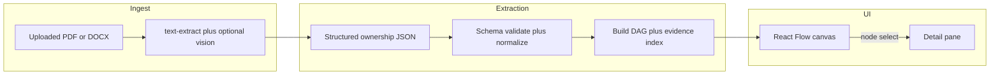
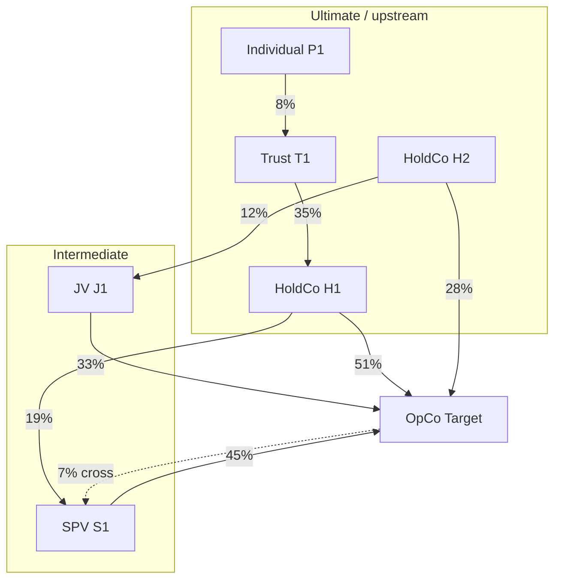
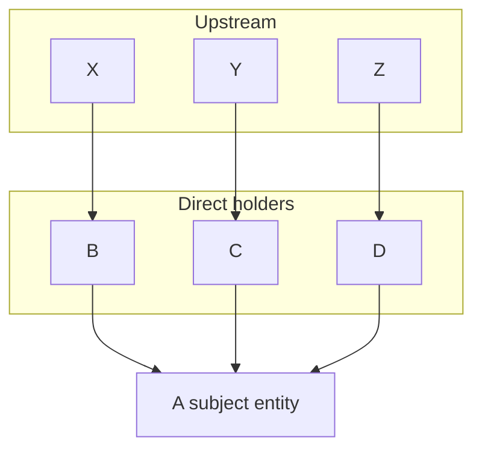

# Ownership structure graph from documents — plan

## Business outcome

Analysts and GRC users can **see multi-level ownership** (e.g. A owned by B, C, D; B by X; C by Y; D by Z) in one place, **trace UBO paths**, and **inspect evidence per entity** without re-reading raw uploads. This reduces misinterpretation of complex cap tables and supports audit narrative (“why we believe X is upstream of A”).

## Assumptions (confirm with product)

- **Primary entry point**: Extend the **UBO / corporate structure** flow ([`client/src/components/UltimateBeneficiaryOwner.jsx`](../../client/src/components/UltimateBeneficiaryOwner.jsx)) rather than only M&A simulator uploads; optionally reuse the same graph component when M&A attaches deal docs later.
- **Truth model**: The graph is **decision-support**, not legal proof; edges carry **confidence** and **source snippet references** where possible.
- **Graph shape**: **Directed graph** (typically a **DAG** toward natural persons or ultimate holding entities). Rare cycles (circular holdings) must be **detected and flagged** in UI, not silently broken.

## Phase 1 — Architecture (no code until reviewed)

### ADR sketch

| ADR | Decision |
| --- | --- |
| **ADR-301** | Canonical model: **nodes** (legal entities / persons) + **edges** (`owns`, `controls`, `votes`; optional `%`, `asOfDate`, `sourceDocId`). Storage: JSON alongside existing UBO payloads or new `server/data/ownership-graphs/` with schema version. |
| **ADR-302** | Visualization: **React Flow** (`@xyflow/react`) or **Elkjs** layout + React Flow—balances trees, modest DAGs, accessibility, and selection APIs. Alternative: D3 tree only—rejected for pan/zoom and node UX cost. |
| **ADR-303** | Extraction: **structured LLM JSON** with **JSON Schema validation** + **deterministic post-processing** (normalize entity names, merge duplicates, compute topological order / cycle detection). |

### Data flow



### API contract (illustrative)

- `POST /api/ubo/ownership-graph/extract` — multipart file → `{ graph, warnings[], extractionMeta }`
- `GET /api/ubo/ownership-graph/:contextId` — optional persistence keyed by org/session (Phase 2)

Errors: `400` validation, `422` unparseable structure, `503` LLM unavailable — align with [ADR-103](../../docs/adr/ADR-103-api-contract-and-failure-mode-policy.md) patterns if present.

### Security

- **MNPI**: Same classification as UBO data; no raw document text in client logs; graph in memory or restricted store.
- **IDOR**: If persisted, scope by **parent/opco** or server-side session; never trust client-only IDs for cross-tenant access.

---

## Phase 2 — Implementation outline

### Backend

1. **Schema** — Define `OwnershipGraphV1`: `nodes[]` (`id`, `label`, `type`: person|corporate|trust|fund, `jurisdiction?`, `identifiers?`), `edges[]` (`source`, `target`, `kind`, `percent?`, `effectiveDate?`, `confidence`, `citations[]` with `{ page?, quote? }`).
2. **Extraction prompt** — New prompt in [`server/routes/ubo.js`](../../server/routes/ubo.js) (or `server/services/ownershipGraphExtract.js`): ask for **full multi-hop** relations found in doc; require **explicit “unknown”** when ambiguous.
3. **Normalization** — Merge “Entity A” / “A Ltd” via fuzzy rules + user-editable alias table later (Phase 3).
4. **Graph algorithms** — Cycle detection, duplicate edge collapse, optional **UBO path** highlight (longest path to person nodes or nodes with `type=person`).
5. **Tests** — Unit tests: fixture JSON → layout-ready graph; edge cases: empty, single edge, cycle, conflicting percentages.

### Frontend

1. **Component** — e.g. [`client/src/components/ownership/OwnershipGraphView.jsx`](../../client/src/components/ownership/OwnershipGraphView.jsx): React Flow canvas, **ELK** or **dagre** layout for layered “tree-like” corporate charts.
2. **Interaction** — Click node → set `selectedNodeId` → **right-hand drawer** (or bottom sheet on narrow view) with: label, jurisdiction, role in graph, **incoming/outgoing** ownership summary, **citations** list, link “open source snippet” if stored.
3. **Multi-root / fan-in** — If A has parents B, C, D, layout shows **three edges upward** from A (not a single parent); selecting B loads B’s details including “owned by X”.
4. **Accessibility** — Keyboard focus moves between nodes; visible focus ring; optional list view fallback (same data).

### Integration point

- After successful **extract-org-from-file** (or new endpoint), attach `ownershipGraph` to the response and render **new tab or section** “Ownership graph” under existing UBO tabs in [`UltimateBeneficiaryOwner.jsx`](../../client/src/components/UltimateBeneficiaryOwner.jsx).

**Dependencies**: add `@xyflow/react` + `elkjs` (or `dagre`) in [`client/package.json`](../../client/package.json); keep bundle impact in mind (lazy-load the graph chunk).

---

## Phase 3 — UX representation (how it looks)

### Layout

| Region | Content |
| --- | --- |
| **Top bar** | Document name, extraction timestamp, “Refresh layout”, legend (edge = ownership %, dashed = voting only). |
| **Main (left/center)** | **Downward or upward** layered graph (user toggle): root = target OpCo or top holdco; **nodes** as rounded cards; **edges** labeled with % where extracted. |
| **Right pane (320–400px)** | **Selected entity**: title, badges (Corporate / Individual), jurisdiction, **Ownership**: “Owned by …” / “Owns …” with %, **Evidence**: bullet list of citations; empty state when nothing selected. |
| **Empty / error** | Illustration + “Upload a cap table or shareholder register” / show `warnings[]` from server. |

### Example structure (same as your A/B/C/D/X/Y/Z story)

Use a **layered layout**:

- **Layer 0 (bottom or top depending on direction)**: A (subject entity)
- **Layer 1**: B, C, D with edges A←B, A←C, A←D (percent labels if present)
- **Layer 2**: X→B, Y→C, Z→D

Selecting **B** in the canvas highlights B and the pane shows B’s attributes plus “Parent: X (…%)”, “Child interest in A: …%”.

### Visual mock — complex holding structure (end-user view)

This section is the **stakeholder-facing mock**: what users see on screen, how color encodes meaning, and how clicks behave. Implementation should match this spec unless UX signs off on changes.

#### Full-screen wireframe (regions and flow)

```text
┌──────────────────────────────────────────────────────────────────────────────────────────────┐
│ Top bar: [Doc: Shareholder_Register_Q3.pdf]  Extracted: 2026-04-03 14:02   [↑ Up] [↓ Down]    │
│ Legend:  ─── equity %     - - - voting only     ⚠ cycle / data issue     [Fit] [Zoom +/-]    │
├───────────────────────────────────────────────────┬──────────────────────────────────────────┤
│ CANVAS (pan/zoom; grid dots 12% opacity)          │ DETAIL PANE (fixed 360px; scroll)         │
│                                                   │ ┌──────────────────────────────────────┐ │
│     [Trust T1]────35%────┐                        │ │ Alpha Holdings Ltd          [Corp]   │ │
│          │               │                        │ │ ADGM • Licence …                     │ │
│     [Individual P1]      │ 42%                    │ │ ───────────────────────────────────  │ │
│                          ▼                        │ │ Owns (downstream)                    │ │
│              [HoldCo H1]────────51%───────┐       │ │ • Beta Sub 45%  • Gamma SPV 10%     │ │
│                     │    \                 │       │ │ Owned by (upstream)                 │ │
│              28%      │     \ 19%          │       │ │ • HoldCo H1 51%  • Trust T1 35%*    │ │
│                 ▼     ▼      ▼             ▼       │ │ Evidence                             │ │
│         [OpCo Target]◄──[SPV S1]    [JV J1]      │ │ • p.2 “…51% ordinary…”             │ │
│              ▲            │             │        │ │ [Highlight on graph]               │ │
│              │            │             │        │ └──────────────────────────────────────┘ │
│         cross-hold 7% ────┘             │        │ * = inferred / low confidence          │
│              └────────────────────────────┘        │                                          │
│   (SPV S1 selected: thick border #2563EB,       │  Empty state: “Select a node on the       │
│    glow; incident edges solid #1D4ED8)           │  chart to see ownership and evidence.”   │
└───────────────────────────────────────────────────┴──────────────────────────────────────────┘
```

**Reading order**: Users typically **start at the subject OpCo** (pinned or visually emphasized), then **trace upward** to find UBOs and **sideways** to SPVs/JVs. The **detail pane** always reflects the **currently selected** node; no selection → empty state with short instruction.

#### Complex structure diagram (Mermaid — richer than the simple A/B/C example)

This mock adds: **family trust**, **individual**, **two holdcos**, **SPV**, **JV**, **cross-hold** (cycle or reciprocal edge flagged in UI), and **multiple paths** to the same downstream entity.



In the real UI, **cross-hold** edges use **amber stroke** and a **“Review”** chip; **cycles** use **red dashed** edge + banner in the top bar.

#### Color and pattern system (semantic tokens)

| Element | Default | Hover | Selected | Focus (keyboard) | Notes |
| --- | --- | --- | --- | --- | --- |
| **Canvas background** | `--surface` / `#F8FAFC` | — | — | — | Subtle dot grid optional |
| **Node: corporate** | Fill `#FFFFFF`, border `#CBD5E1` 1px | Border `#94A3B8`, shadow sm | Border `#2563EB` 2px, shadow md, label **semibold** | 2px `#0EA5E9` ring offset 2px | Jurisdiction chip: bg `#EEF2FF` text `#3730A3` |
| **Node: individual** | Fill `#F0FDF4`, border `#86EFAC` | Darken border | Same blue selection as corporate | Same ring | Icon or “IND” badge |
| **Node: trust / fund** | Fill `#FFFBEB`, border `#FCD34D` | — | Same selection | Same ring | Tooltip “Verify trust deed” |
| **Node: warning** (incomplete data) | Amber border `#F59E0B`, small **!** glyph | — | Selection still works | — | Listed in pane under “Data quality” |
| **Edge: equity** | Solid `#64748B` 2px, label `%` `#334155` | Edge `#475569`, thicker hit-area | Both endpoints of selected edge emphasize | — | Arrowhead toward **owned** entity |
| **Edge: voting only** | Dashed `#94A3B8` | — | — | — | Legend in top bar |
| **Edge: cross / cycle** | Amber `#D97706` or Red `#DC2626` dashed | — | — | — | Top bar alert strip |

Use **CSS variables** aligned with existing app tokens (`var(--text)`, `var(--border)`) where possible so dark mode can be added later without redesigning the graph.

#### Clickability and interaction behavior

| User action | Visual feedback | Pane / system behavior |
| --- | --- | --- |
| **Click node** | Node enters **selected** state (blue border); other nodes normal; **edges incident** to that node slightly thicker | Detail pane loads entity: identifiers, jurisdiction, **Owns** / **Owned by** lists with %, citations |
| **Click same node again** | Optional: collapse pane section; or no-op | Product choice: deselect on second click vs keep selection |
| **Click empty canvas** | Selection clears | Pane shows **empty state** (“Select a node…”) |
| **Click edge** (optional v1.1) | Edge highlights; endpoints pulse | Pane shows **edge**: from, to, %, instrument, citation |
| **Hover node** | Hover ring (light); cursor `pointer`; optional tooltip: short label + total upstream % | No pane change until click |
| **Keyboard Tab** | Focus ring visible on nodes in DOM order or spatial order | Enter = same as click; Escape = clear selection |
| **Pan / zoom canvas** | Grab hand cursor while drag | Selection **persists**; pane still shows last selected node |
| **Node with issue** (cycle member) | Red/orange badge on card | Pane top: **Warning** strip with explanation and link to evidence |

#### ASCII “screenshot” — dense graph + selected state (single glance)

```text
                    ┌─────────────┐
                    │  Trust T1   │──────────────┐
                    └─────────────┘              │
                           │ 35%                 │
                           ▼                     │
                    ┌─────────────┐         ┌──┴──────────┐
         ┌──────────│  HoldCo H1  │─────────│  HoldCo H2  │───┐
         │ 51%      └─────────────┘   19%   └─────────────┘   │12%
         │               │    \              │                │
         │               │     ╲             ▼                ┌──▼───┐
         │               ▼      ╲      ┌─────────┐          │ JV J1│
         │         ┌─────────┐  ╲────│ SPV S1  │          └──┬───┘
         │         │ OpCo    │◄──────│ 45%     │             │33%
         └────────►│ Target ◄├───────└─────────┘             │
              28%  │  ★      │◄─────────────────────────────┘
                   └─────────┘
                   ★ = focal entity (accent fill #EFF6FF)
   Selected: SPV S1 — border ████ blue #2563EB; incoming edge from H1 bold
```

### Visual (simple A/B/C/D reference — retained)



### Figma mock (yes — add it here)

A **Figma** (or FigJam) mock fits this document well: it is the usual source of truth for **layout, spacing, and pixel-level color** before engineering. Use one or more of the following so the sprint doc stays useful in GitHub and offline:

| Approach | When to use | What to put in this doc |
| -------- | ----------- | ------------------------ |
| **A. Link** | File is in team Figma; everyone has access | A short subsection with **[View Figma mock](https://www.figma.com/file/REPLACE_ME/ownership-graph)** (replace `REPLACE_ME` with your file key). Add password note only if the file is prototype-protected (prefer view link + team access instead). |
| **B. Exported image in repo** | PR reviewers must see the UI without Figma | Export **PNG** (2× for retina) or **SVG** from Figma, commit under `sprints/ownership-graph-from-documents/assets/` (e.g. `ownership-graph-desktop.png`), then embed in this markdown: ``. |
| **C. Snapshot + link** | Best of both | One hero image in-repo (B) **plus** the canonical Figma link (A) for iteration. |

**What to include in the Figma frame** (align with sections above): canvas + nodes/edges using the **color and pattern system** table; **selected** node state; **detail pane** at 360px width; top bar with legend; optional **mobile** frame (bottom sheet instead of side pane).

**Placeholder** (delete after adding real assets):

- Figma file URL: `_Paste Figma file link here_`
- Exported image: add files under `./assets/` and reference them above.

**Raster-only alternative**: For a PNG stakeholder slide, export from Figma using the **color table** and **wireframe** sections in this document, or generate a static image in implementation matching those tokens.

---

## UX deep dive (reviewer lens — user-centricity, navigability, function)

This section records what must be addressed for the experience to feel **exceptionally user-centric**: clarity of purpose, low cognitive load, confident navigation in a complex visual, and functional completeness from the user’s point of view (not only engineering). It complements Phase 3 visuals with **jobs-to-be-done**, **wayfinding**, **states**, **trust**, and **accessibility**.

### Personas and jobs-to-be-done (why navigability matters)

| Persona | Primary job | UX risk if ignored |
| -------- | ----------- | ------------------ |
| **Corp dev / PMO** | Answer “who ultimately owns or controls this target?” quickly | Gets lost after zoom/pan; no focal entity; no path highlight |
| **GRC / compliance** | Prove **evidence** for each link (audit narrative) | Citations buried; unclear confidence; cannot trace edge → document |
| **Legal / external counsel** | Validate structure against a schedule; export for board pack | No print/PDF; illegible labels at zoom; no list view |
| **Casual reviewer (exec)** | Glance at structure without training | Too dense; no summary strip; jargon-only labels |

**Design implication**: The UI must support **three speeds** — glance (summary + focal node), navigate (orientation + search/focus), defend (evidence + confidence per edge/node).

### User-centric principles (must-haves)

1. **Orientation always visible** — After any pan/zoom, the user must know **which entity is the subject OpCo** (focal badge, persistent label in top bar, or “Reset to subject” control). Without this, the graph feels like a map without “you are here.”
2. **Progressive disclosure** — Default view: **readable node count** (collapse subsidiaries behind “+ N” or level-of-detail); advanced: full expansion. Avoid showing 80 nodes at once without grouping or filters.
3. **Plain language** — Pair internal types (`corporate`, `trust`) with **short labels users recognize** (“Company”, “Trust”, “Person”). Tooltips expand with legal nuance; pane uses sentences, not only field keys.
4. **Trust and uncertainty** — Any **inferred**, **low-confidence**, or **conflict** (two percentages for same edge) must be **visible in the pane and on the graph** (icon, stripe, or chip), with a one-line explanation and link to evidence. Silence reads as certainty.
5. **Recoverability** — Errors (extraction failed, partial graph, LLM down) need **actionable** copy: what still works, what to retry, whether manual entry is possible later—not only error codes.

### Navigability (information architecture and wayfinding)

| Topic | What to add | Rationale |
| ----- | ----------- | --------- |
| **Entry from UBO** | Clear **tab/section label** (“Ownership graph”) + one-line **subtitle** (“From your uploaded document — decision support, not legal advice”) | Sets mental model before the canvas loads |
| **Within-graph orientation** | **Minimap** (React Flow) or **breadcrumb trail** of selected path (e.g. `Target ← SPV ← HoldCo`) | Reduces “where am I?” after zoom |
| **Focal entity** | **Pin / “Focus on subject”** button resets viewport and selection to subject OpCo | Primary task is trace from target |
| **Path tracing** | **“Highlight path to…”** control: pick a node (e.g. individual UBO) and highlight directed path; optional **shortest path** vs **all paths** | Core GRC job; not obvious from click-only |
| **Search** | **Filter or search box** for entity name (filters nodes/labels; scroll-into-view) | Large graphs; matches legal mental model (“find X Ltd”) |
| **Layout direction** | Persist user’s **up/down** preference in **localStorage** | Avoids re-learning on every visit |
| **Deep linking (Phase 2)** | URL query `?node=id` opens tab with node selected | Shareable for review threads |
| **Cross-link to register** | From pane, **“Open in UBO register”** when entity exists in table | Continuity across tabs; reduces duplicate data entry anxiety |

### Detail pane: content hierarchy (scannable in under 10 seconds)

Order sections **fixed** for muscle memory:

1. **Title row** — Entity name + type badge + optional status (warning / complete).
2. **One-line summary** — “Holds 45% of [Target] via ordinary shares” (templated from graph math).
3. **Upstream / downstream** — Collapsible if long; **percent always adjacent** to counterparty name.
4. **Evidence** — Page/quote; **empty state** explains “No citation extracted for this relationship” (honest).
5. **Data quality** — Only if issues (inferred, conflict, stale doc date).
6. **Actions** — Secondary: “Copy summary”, “Export this node” (future).

**Pane ergonomics**: Sticky section headers on scroll; **line length** capped (~65ch) for readability.

### Functional UX (beyond click/hover — system behavior)

| State | User need | UX treatment |
| ----- | --------- | -------------- |
| **First visit** | What is this? | Optional **dismissible coach mark** (3 bullets: select node, read pane, use search) or link “How to read this chart” |
| **Loading** | System not frozen | **Skeleton** for pane + canvas placeholder; indeterminate progress if extraction &gt;2s |
| **Empty (no upload)** | What to do | Illustration + **primary CTA** “Upload document” + accepted formats |
| **Partial extraction** | Can I trust it? | **Banner**: “Showing 4 of 7 relationships; see warnings” + list in pane |
| **Extraction failure** | Next step | Message + **retry** + **fallback**: “View table view only” if list view exists |
| **Very large graph** | Performance + clarity | **Cluster** or **level-of-detail**; warn before render (“200 nodes — simplify layout?”) |
| **Edge selected (v1.1)** | Consistency | Pane title switches to “Relationship: A → B” so users don’t think node context vanished |
| **Print / board pack** | Offline | **Print stylesheet** or **Export PNG/PDF of canvas + pane summary** (Phase 2) |

### Accessibility (WCAG-minded, beyond Tab-through nodes)

- **Screen readers**: Announce **selection changes** (`aria-live="polite"` on pane); nodes as **buttons** or **treeitems** with **accessible name** = entity name + role + key %.
- **Contrast**: Edge labels and minimap meet **4.5:1** on background; focus ring **never** color-only.
- **Motion**: Respect **`prefers-reduced-motion`** (disable zoom animations; instant fit).
- **Touch**: **44px min** hit targets on nodes or a **larger “tap target”** invisible buffer on mobile.

### Mobile and narrow viewports

- **Bottom sheet** for pane (per Figma note) with **drag handle** and **half/full height** snap.
- **Toolbar** collapses to overflow menu (Fit, Search, Focus subject).
- Consider **list-first** variant on very narrow screens (graph secondary) for usability.

### Trust, compliance, and copy

- **Persistent disclaimer** (short) near chart or in pane footer: decision-support; verify against source documents.
- **Document date** and **extraction timestamp** in top bar (already in wireframe) — critical for audit comparability.
- **Version** of extraction schema (`schemaVersion`) surfaced in **About this chart** popover for support tickets.

### UX acceptance criteria (add to QA)

- [ ] New user completes **one successful path trace** (subject → UBO) in under **2 minutes** without docs (usability test).
- [ ] With **50+ nodes**, user can **find named entity** via search in under **30 seconds**.
- [ ] **Keyboard-only** user can select node, read pane, clear selection, and use Focus subject.
- [ ] **Screen reader** announces selection and pane update (smoke test).
- [ ] All **error/partial** states use **human sentences**, not raw API errors.

### Prioritized UX backlog (suggested order)

| Priority | Item | Notes |
| -------- | ---- | ----- |
| P0 | Focal subject + Focus subject + orientation | Core navigability |
| P0 | Loading / empty / partial / error states | Trust and recovery |
| P0 | Pane hierarchy + confidence / inference | GRC credibility |
| P1 | Search/filter + minimap | Large graphs |
| P1 | Path highlight (to UBO or selected node) | Core job |
| P2 | Deep link + print/export | Collaboration |
| P2 | Coach marks / onboarding | Adoption |

---

## Verification

- **Functional**: Upload fixture docs → graph node count and edges match expected; selection updates pane; keyboard navigation works.
- **UX / navigability**: Meet the **UX acceptance criteria** listed under *UX deep dive* in this document (path trace task, search on large graph, keyboard-only, screen reader smoke, human-readable errors).
- **Regression**: Existing UBO table/register flows unchanged when graph extraction fails (graceful degrade).
- **Security**: No document secrets in console; audit log optional `ownership_graph_viewed` if required by GRC.

## Out of scope (initial slice)

- Real-time collaboration, diff across two documents, automatic Companies House API enrichment (can be Phase 4).

---

## Implementation checklist

- [ ] Figma (or FigJam) mock linked and/or exported PNG/SVG under `sprints/ownership-graph-from-documents/assets/` (optional but recommended for sign-off)
- [x] Write ADR-301..303 and align API errors with ADR-103
- [x] Define OwnershipGraphV1 JSON Schema + extraction service + validation
- [x] Add POST extract (+ optional GET persist) in ubo routes
- [x] OwnershipGraphView with React Flow + ELK/dagre + detail pane
- [x] Wire new tab/section in UltimateBeneficiaryOwner.jsx
- [x] UX: focal subject, Focus subject, loading/empty/partial/error states, pane hierarchy, search (or defer with explicit Phase-2 note), minimap or path breadcrumb (P0/P1 per UX backlog)
- [x] Unit tests for graph build, cycles, fixtures; client smoke

**Outcome log:** see [`SPRINT-OUTCOME.md`](./SPRINT-OUTCOME.md).

**Phase 2 (backlog) — implemented in repo**

- **Figma / design asset:** [`assets/README.md`](./assets/README.md) + [`assets/ownership-graph-desktop.svg`](./assets/ownership-graph-desktop.svg) (wireframe; replace Figma link when available).
- **GET persistence:** `GET /api/ubo/ownership-graph/:contextId` + `POST /api/ubo/ownership-graph/save` — storage `server/data/ownership-graphs/graphs.json`, context id from parent + OpCo scope (`ownershipGraphContextId.js`).
- **Open in UBO register:** node detail pane button when a graph label matches an OpCo in the register.
- **Edge-click pane:** click an edge to show relationship-only pane (from → to, citations).
- **Coach marks:** first-visit overlay (`OwnershipCoachMarks.jsx`, `localStorage` key `og-coach-v1-dismissed`).
- **E2E:** Playwright (`playwright.config.cjs`, `npm run test:e2e`), spec `e2e/ubo-ownership-graph.spec.js` (mocked APIs + parent select).
